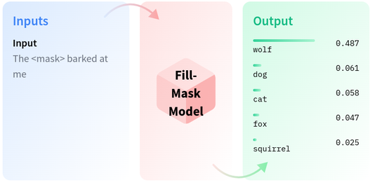

# Fill-Mask

## Description

Masked language modeling is the task of masking some of the words in a sentence and predicting which words should replace those masks.
These models are useful when we want to get a statistical understanding of the language in which the model is trained in.

