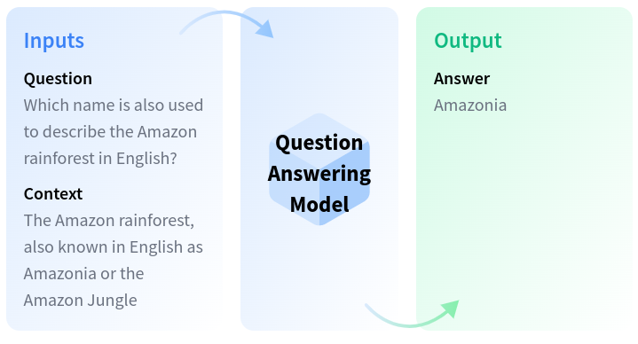

# Question Answering

## Description

Question Answering models can retrieve the answer to a question from a given text, which is useful for searching for an answer in a document.
Some question answering models can generate answers without context!

