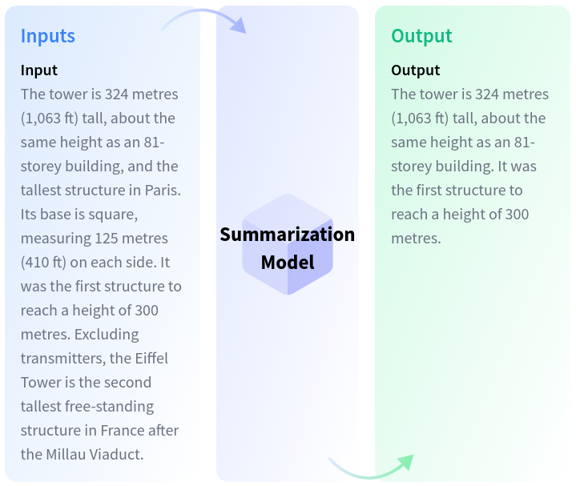

# Text Summarization

## Description

Summarization is the task of producing a shorter version of a document while preserving its important information.
Some models can extract text from the original input, while other models can generate entirely new text.

