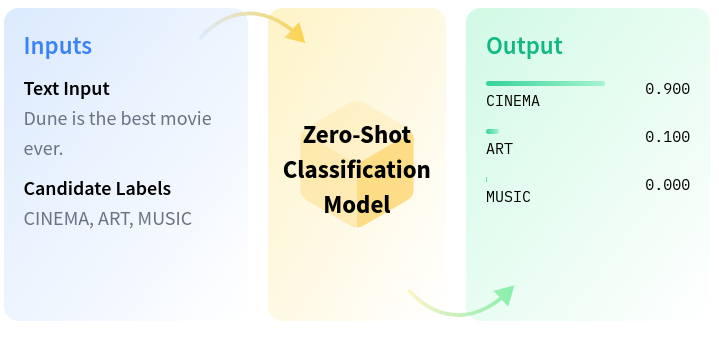

# Zero-Shot Classification

## Description

Is a task in natural language processing where a model is trained on a set of labeled examples but is then able to classify new examples from previously **unseen** classes.

