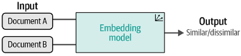

# Contrastive Learning [Self-Sup]

## Overview

One major technique for both training and fine-tuning text embedding models is called contrastive learning.
Contrastive learning is a technique that aims to train an embedding model such that similar documents are closer in vector space while dissimilar documents are further apart.

The underlying idea of contrastive learning is that the best way to learn and model similarity/dissimilarity between documents is by feeding a model examples of similar and dissimilar pairs.
In order to accurately capture the semantic nature of a document, it often needs to be contrasted with another document for a model to learn what makes it different or similar.
This contrasting procedure is quite powerful and relates to the context in which documents are written.

## Cross-Encoder (Reranking)

A cross-encoder allows two sentences to be passed to the Transformer network simultaneously to predict the extent to which the two sentences are similar.
It does so by adding a classification head to the original architecture that can output a similarity score.
However, the number of computations rises quickly when you want to find the highest pair in a collection of 10,000 sentences.
That would require $n \cdot (n-1)/2 = 49,995,000$ inference computations and therefore generates significant overhead.
Moreover, a cross-encoder generally does not generate embeddings.
Instead, it outputs a similarity score between the input sentences.

## Bi-Encoders (Dense Retrieval) (Embedding) (SBERT)

Unlike a cross-encoder, the classification head is dropped, and instead mean pooling is used on the final output layer to generate an embedding.
This pooling layer averages the word embeddings and gives back a fixed dimensional output vector.
This ensures a fixed-size embedding.
