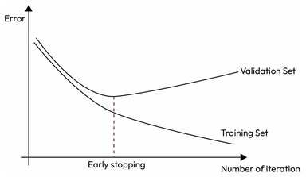

# Early Stopping

## Description

Early stopping is a technique that's used to stop the training process when the performance of the model on the validation data starts to degrade.
This helps to prevent overfitting by stopping the model from continuing to learn from the training data when it has already reached its maximum performance.
This technique is usually used in iterative algorithms such as deep learning methods, where the model is being trained for multiple iterations (epochs).

To use early stopping, we usually train the model while evaluating the model performance on the training and validation subsets.
The model's performance usually improves on the training set with more training, but since the model has not seen the validation set, the validation error usually decreases initially and at some point, starts increasing again.
This point is where the model starts overfitting.

By visualizing the training and validation error of the model during training, we can identify and stop the model at this point.



!!! info

    With stochastic and mini-batch gradient descent, the curves are not so smooth, and it may be hard to know whether you have reached the minimum or not.
    One solution is to stop only after the validation error has been above the minimum for some time (when you are confident that the model will not do any better), then roll back the model parameters to the point where the validation error was at a minimum.

## Example

```python
from copy import deepcopy
from sklearn.metrics import root_mean_squared_error
from sklearn.preprocessing import StandardScaler
from sklearn.pipeline import make_pipeline
from sklearn.linear_model import SGDRegressor
from sklearn.preprocessing import PolynomialFeatures

X_train, y_train, X_valid, y_valid = ...

preprocessing = make_pipeline(PolynomialFeatures(degree=90, include_bias=False), StandardScaler())
X_train_prep = preprocessing.fit_transform(X_train)
X_valid_prep = preprocessing.transform(X_valid)

sgd_reg = SGDRegressor(penalty=None, eta0=0.002, random_state=42)
n_epochs = 500
best_valid_rmse = float("inf")
best_model = None

for epoch in range(n_epochs):
    sgd_reg.partial_fit(X_train_prep, y_train)
    y_valid_predict = sgd_reg.predict(X_valid_prep)
    val_error = root_mean_squared_error(y_valid, y_valid_predict)
    if val_error < best_valid_rmse:
        best_valid_rmse = val_error
        best_model = deepcopy(sgd_reg)
```
