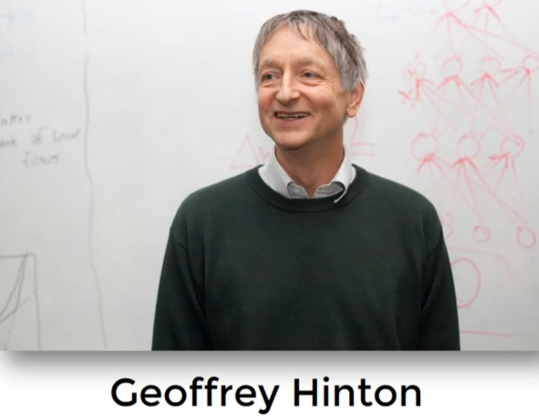
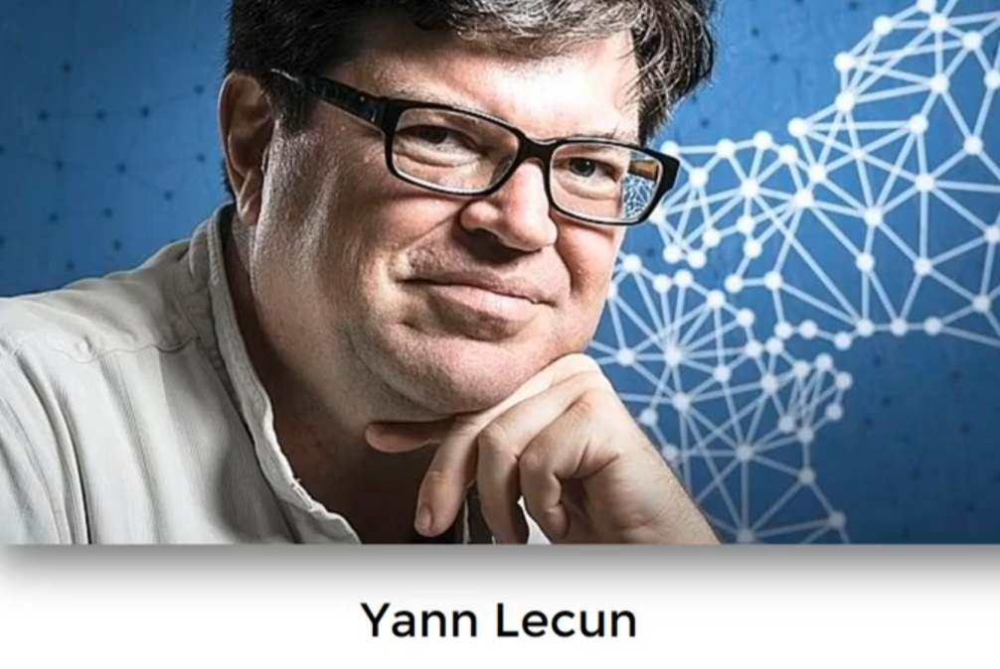

# AI

## NN Memory

- Memory: **3.6 bytes** per parameter
- Double Descent: At first, the model tries to just memorize the data, so it gradually improves. But once its memory fills up, it has to slowly start discarding what it memorized and actually learn the underlying logic of the subject. As a result, the model keeps getting better over time, then suddenly its quality drops, and after that, it begins improving again.

## Transformer Layers

Different layers in a transformer specialize in different linguistic properties:

- **Lower layers**: Capture syntax and token identity.
- **Middle layers**: Handle grammar and sentence structure.
- **Deeper layers**: Focus on semantics, reasoning, and factual recall.

## H100 Varieties

| Feature               | H100 PCIe                                                                          | H100 SXM                                                                          | H100 NVL                                                        |
| --------------------- | ---------------------------------------------------------------------------------- | --------------------------------------------------------------------------------- | --------------------------------------------------------------- |
| **Connection**        | Standard PCIe slot                                                                 | Custom socket on DGX/HGX boards                                                   | PCIe slot (two cards bridged)                                   |
| **RAM to VRAM Speed** | Slower (limited by PCIe bus)                                                       | Fastest                                                                           | Slower (limited by PCIe bus)                                    |
| **GPU to GPU Speed**  | Slower                                                                             | Fastest (via NVLink on the board)                                                 | Very Fast (via dedicated NVLink Bridge)                         |
| **VRAM Type**         | HBM2e                                                                              | HBM3                                                                              | HBM3                                                            |
| **VRAM Size**         | 80 GB                                                                              | 80 GB                                                                             | 192 GB total (2x 96 GB)                                         |
| **Best For**          | General compatibility, single-card setups where PCIe bandwidth isn't a bottleneck. | Demanding single-GPU or multi-GPU tasks needing the highest RAM-to-GPU bandwidth. | Dual-GPU tasks with massive data transfer between the two GPUs. |
| **Key Downside**      | Slower data transfer to and from system RAM.                                       | Requires specific, expensive motherboards (DGX/HGX).                              | Acts as a pair; not ideal for scaling beyond two bridged GPUs.  |

## Benchmarks

| Benchmark                                       | Focus Area                    | Description                                                            | Example Metrics        |
| ----------------------------------------------- | ----------------------------- | ---------------------------------------------------------------------- | ---------------------- |
| MMLU (Massive Multitask Language Understanding) | General knowledge & reasoning | 57 subjects covering STEM, humanities, social sciences, etc.           | Accuracy (%)           |
| HellaSwag                                       | Commonsense reasoning         | Tests everyday scenario understanding                                  | Accuracy (%)           |
| ARC (AI2 Reasoning Challenge)                   | Logical reasoning             | Grade-school-level science and reasoning questions                     | Accuracy (%)           |
| GSM8K (Grade School Math 8K)                    | Math reasoning                | Solving elementary school-level math problems                          | Accuracy (%)           |
| MATH                                            | Advanced math                 | Tests high-school & olympiad-level math ability                        | Accuracy (%)           |
| BBH (BigBench Hard)                             | Complex reasoning             | Harder subset of BigBench tasks, including ethics, social dynamics     | Accuracy (%)           |
| TruthfulQA                                      | Truthfulness                  | Measures resistance to misinformation and factual consistency          | Truthfulness Score (%) |
| MT-Bench                                        | Multi-turn chat               | Evaluates LLMs in a conversational multi-turn dialogue setting         | Score (1-10)           |
| HumanEval                                       | Code generation               | Tests LLMs' ability to write functional code                           | Pass@1 (%)             |
| MBPP (Multi-turn Python Benchmark)              | Python programming            | Evaluates Python code generation for multi-turn problem-solving        | Pass@1 (%)             |
| OpenAI's Chatbot Arena                          | Overall LLM ranking           | Human preference ranking of chatbot responses                          | Elo Score              |
| AGIEval                                         | Human-like intelligence       | Measures model performance on human exams (SAT, GRE, LSAT, etc.)       | Score (%)              |
| SuperGLUE                                       | NLP general tasks             | Evaluates performance across a variety of NLP tasks                    | Accuracy (%)           |
| TyDiQA                                          | Multilingual QA               | Tests question-answering ability in multiple languages                 | F1 Score               |
| GSM-PLUS                                        | Math reasoning & tool use     | An extension of GSM8K that requires planning and tool use              | Accuracy (%)           |
| TMGBench                                        | Table-based reasoning         | A benchmark for table-based machine reading comprehension              | F1 Score               |
| VL-RewardBench                                  | Vision-language alignment     | Evaluates how well vision-language models align with human preferences | Accuracy (%)           |

## Singularity

- Researcher: Ray Kurzweil
- Reference: Based on Moore's law

## Godfathers

=== "AI"

    

=== "Convolutional NN"

    

## Scikit-Learn

=== "Pipeline"

    ```python
    from sklearn.compose import ColumnTransformer, make_column_transformer, make_column_selector
    from sklearn.pipeline import make_pipeline

    num_pipeline = make_pipeline(SimpleImputer(strategy="median"), StandardScaler())
    cat_pipeline = make_pipeline(SimpleImputer(strategy="most_frequent"), OneHotEncoder(handle_unknown="ignore"))

    # Automatic approach
    preprocessing = make_column_transformer(
        (num_pipeline, make_column_selector(dtype_include=np.number)),  # Detects numerical columns
        (cat_pipeline, make_column_selector(dtype_include=object)),  # Detects categorical columns
    )

    # Manual approach (to have more control)
    num_attribs = ["longitude", "latitude", ...]
    cat_attribs = ["ocean_proximity", ...]

    preprocessing = ColumnTransformer([
        ("num", num_pipeline, num_attribs),
        ("cat", cat_pipeline, cat_attribs),
    ])
    ```
