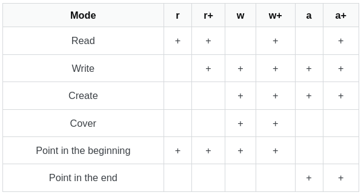
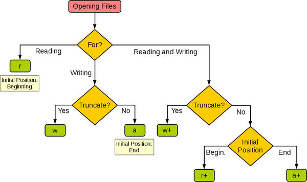
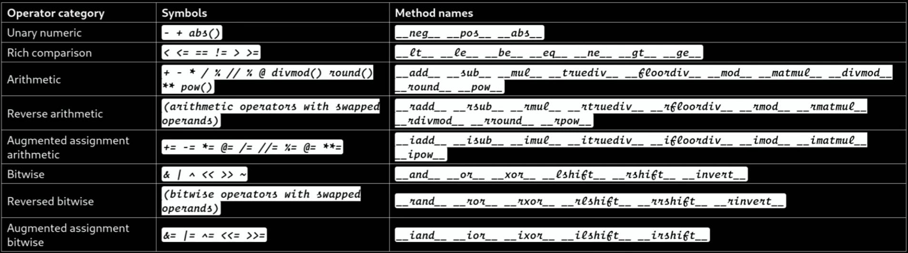
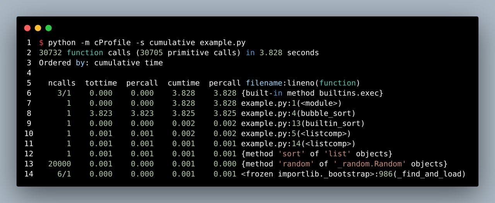

# Python

## File

- Open modes:

  

- Open modes decision tree:

  

## Class & Function

- Get full path:

  ```python
  import os
  import inspect

  def foo():
    pass

  print(os.path.abspath(inspect.getfile(foo)))

  class Bar:
    pass

  print(os.path.abspath(inspect.getfile(Bar.__class__)))
  ```

## Modules & Packages

- Get all import able modules & packages:

  ```python
  import pkgutil
  search_path = ['.'] # set to None to see all modules importable from sys.path
  all_modules = [x[1] for x in pkgutil.iter_modules(path=search_path)]
  print(all_modules)
  ```

## Celery

- Kill celery process:

  ```shell
  kill -9 $(ps aux | grep celery | grep -v grep | awk '{print $2}' | tr '\n' ' ') > /dev/null 2>&1
  ```

- View worker logs:

  ```shell
  celery -A <worker name: karestoon> worker --loglevel=info
  ```

## PIP

- Install from source (Unix path):

  ```shell
  pip install file:///path/to/package
  ```

## Operators

- Overview

  

- The "i" symbol means "in place"
- The "a" symbol means "asynchronous"
- The "r" symbol means "reverse"
- When we are implementing the "Rich comparison" method we should return a new object, in the other hand for the "Augmented assignment arithmetic" method we should update the current object

## Other

- Growth rates of common functions measured in nanoseconds:

  | n             | lg n     | n        | n lg n    | n²         | 2ⁿ           | n!             |
  | ------------- | -------- | -------- | --------- | ---------- | ------------ | -------------- |
  | 10            | 0.003 μs | 0.01 μs  | 0.033 μs  | 0.1 μs     | 1 μs         | 3.63 ms        |
  | 20            | 0.004 μs | 0.02 μs  | 0.086 μs  | 0.4 μs     | 1 ms         | 77.1 years     |
  | 30            | 0.005 μs | 0.03 μs  | 0.147 μs  | 0.9 μs     | 1 sec        | 8.4 × 10¹⁵ yrs |
  | 40            | 0.005 μs | 0.04 μs  | 0.213 μs  | 1.6 μs     | 18.3 min     |                |
  | 50            | 0.006 μs | 0.05 μs  | 0.282 μs  | 2.5 μs     | 13 days      |                |
  | 100           | 0.007 μs | 0.1 μs   | 0.644 μs  | 10 μs      | 4 × 10¹³ yrs |                |
  | 1,000         | 0.010 μs | 1.00 μs  | 9.966 μs  | 1 ms       |              |                |
  | 10,000        | 0.013 μs | 10 μs    | 130 μs    | 100 ms     |              |                |
  | 100,000       | 0.017 μs | 0.10 ms  | 1.67 ms   | 10 sec     |              |                |
  | 1,000,000     | 0.020 μs | 1 ms     | 19.93 ms  | 16.7 min   |              |                |
  | 10,000,000    | 0.023 μs | 0.01 sec | 0.23 sec  | 1.16 days  |              |                |
  | 100,000,000   | 0.027 μs | 0.10 sec | 2.66 sec  | 115.7 days |              |                |
  | 1,000,000,000 | 0.030 μs | 1 sec    | 29.90 sec | 31.7 years |              |                |

- cProfile example:

  
