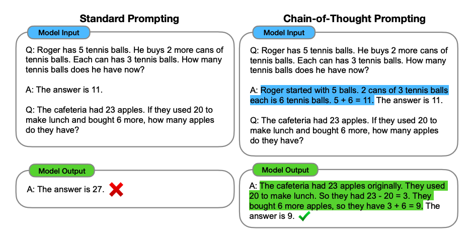
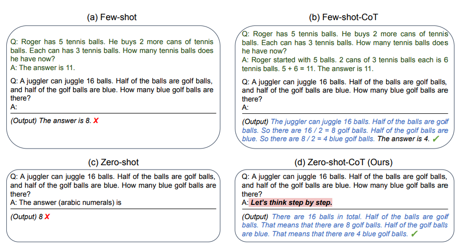

# Chain-of-Thought (CoT)

## Description

Enables complex reasoning capabilities through intermediate reasoning steps. (In the following image we can see an example of a Few-shot CoT Prompting)

## Few-Shot & Zero-Shot CoT Prompting

- **Few-Shot:** Combining the original prompt with few-shot prompting.
- **Zero-Shot:** Involves adding "Let's think step by step" to the original prompt.

