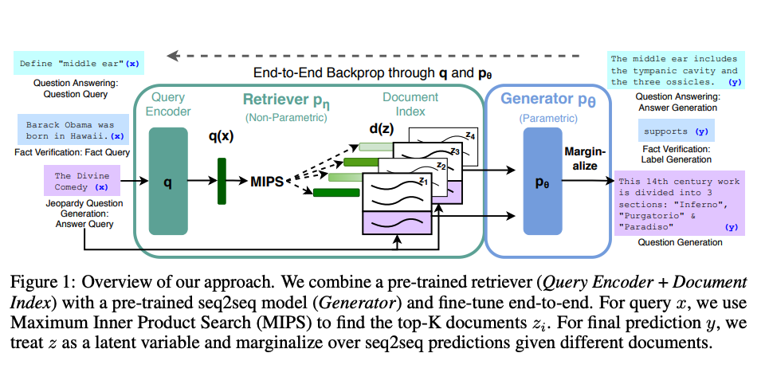

# Retrieval Augmented Generation (RAG)

## Description

Retrieval Augmented Generation (RAG) enhances language model capabilities by integrating an information retrieval component with a text generator. This combination enables models to access external knowledge sources, improving factual accuracy and reliability.

- **Dynamic Knowledge Access**: RAG allows models to adapt to new information without needing complete retraining.
- **Factual Consistency**: By leveraging external data, RAG reduces the chances of generating incorrect or "hallucinated" content.

## Workflow

- **Input Processing**: RAG takes user input and retrieves relevant documents from a knowledge source (e.g., Wikipedia).
- **Document Integration**: The retrieved documents are combined with the input prompt.
- **Text Generation**: The augmented prompt is processed by the language model to generate a final output.
