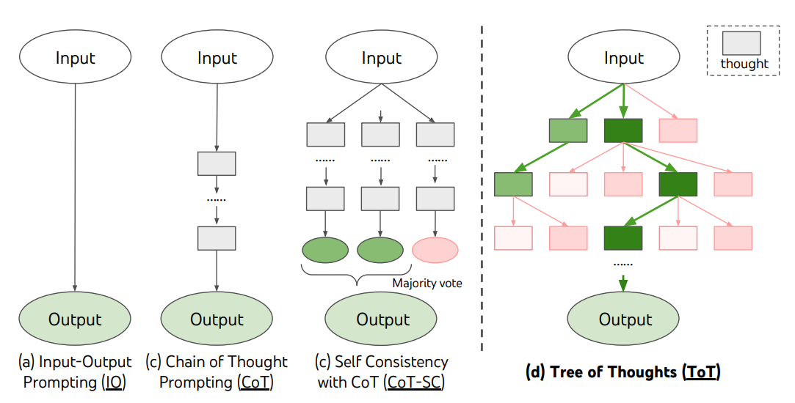
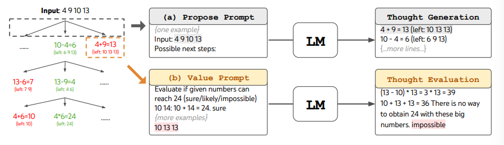

# Tree of Thoughts (ToT)

## Descriptions

The "Tree of Thoughts" (ToT) framework enhances complex problem-solving by maintaining a tree of thoughts, allowing language models to explore and evaluate intermediate steps.

It combines thought generation with search algorithms like breadth-first and depth-first search for systematic exploration. This approach helps identify potential solutions by categorizing thoughts as "sure," "maybe," or "impossible," promoting effective partial solutions while eliminating unfeasible ones.

