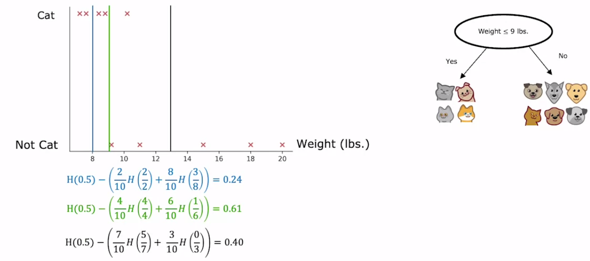

# 一Share (Information Gain Technique) [Tree]

## Description

- از این فرمول برای انتخاب ترتیب شکستن شاخه ها استفاده میشه
- هر چقدر یک ویژگی (feature یا input) به ما entropy بهتری بده (نزدیکتر به ۰) به این معنیه که اول بر اساس اون ویژگی بشکنیم بعدش بریم سراغ ویژگی های بعدی

تو تصویر بالا جایی که هیچکدوم از حیوون ها گربه نیستن فرمول به ما ۰ داده و همینطور جایی که همه شون گربه هستن هم ۰ داده (فرقی نداره که همه باشن یا هیچکدوم نباشن، همین که purity رعایت بشه کافیه)

حالا وقتی میخوایم از فرمول entropy برای decision trees استفاده کنیم، باید entropy هر طرف رو حساب کنیم، میانگینش رو بدست بیاریم (میانگین بر اساس تعداد دیتاهای هر سمت) و آخرسر نتیجه رو از entropy اولیه دیتا ست کم کنیم، به این فرمول میگن فرمول information gain که هرچقدر حاصل فرمول information gain بیشتر باشه یعنی گزینه بهتریه. (تو تصویر چون information gain سمت چپی بیشتره پس بر اساس اون دیتا مون رو میشکنیم)

برای فیچر هایی که یک مقدار ثابت ندارن (مثلا وزن) با استفاده از تکنیک تصویر زیر اون هارو به حالت True و False ای تغییر میدیم:

