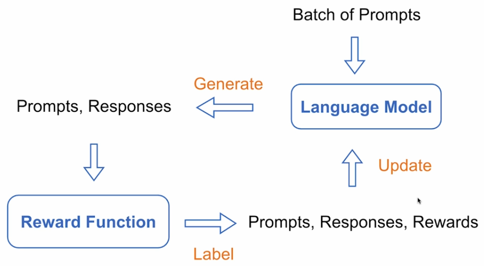
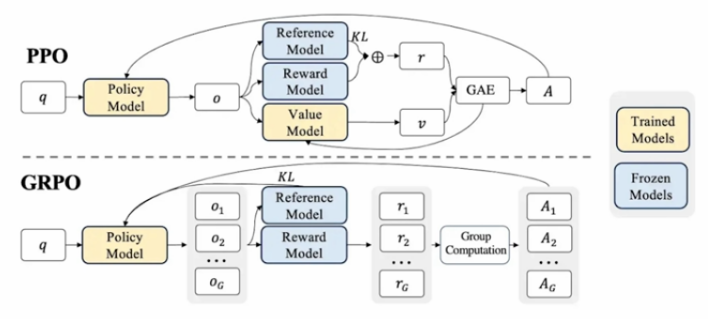

# Online RL [PPO] [GRPO]

## Description

Online Reinforcement Learning is a method for continuously improving language models by gathering **real-time** feedback and updating the model in a loop. Unlike static datasets, Online RL allows a model to learn from **its own deployed outputs**, incorporating fresh human (or synthetic) feedback into the training process. This enables adaptive alignment with evolving user preferences and tasks.

## Workflow

1. **Deployment & Feedback Loop**: Deploy the model and collect interaction data from users, including implicit or explicit preference signals (e.g., thumbs up/down, rankings).
2. **Reward Model Updates**: Continuously update or retrain the reward model using new preference data.
3. **Policy Optimization:**
   - Use algorithms like **Proximal Policy Optimization (PPO)** to fine-tune the language model against the reward model.
   - Optionally use **Generalized Reward Policy Optimization (GRPO)** to better handle non-stationary rewards and long-horizon feedback.
4. **Evaluation**: Periodically assess model behavior using alignment metrics, task performance, and user satisfaction.

## PPO vs GRPO

- **PPO (Proximal Policy Optimization)**: A stable, widely-used RL algorithm that prevents large policy updates, reducing training instability.
- **GRPO (Generalized Reward Policy Optimization)**: Extends PPO by incorporating reward generalization techniques, making it more robust to sparse, delayed, or shifting feedback.

## Use Cases

- Continual improvement of deployed assistants and chatbots.
- Fine-tuning moderation or recommendation systems with live user feedback.
- Adaptive task-solving agents in dynamic environments.
