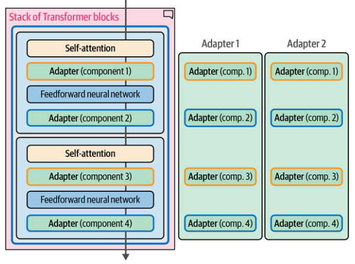

# Parameter-Efficient Fine-Tuning (PEFT)

## Description

Updating all parameters of a model has a large potential of increasing its performance but comes with several disadvantages. It is costly to train, has slow training times, and requires significant storage. To resolve these issues, attention has been given to parameter-efficient fine-tuning (PEFT) alternatives that focus on fine-tuning pretrained models at higher computational efficiency.

!!! info

    Fine-tuning 3.6% of the parameters of BERT for a task can yield comparable performance to fine-tuning all the model’s weights. On the GLUE benchmark, the authors show they reach within 0.4% of the performance of full fine-tuning.

## Adapters

Adapters are a core component of many PEFT-based techniques. The method proposes a set of additional modular components inside the Transformer that can be fine-tuned to improve the model’s performance on a specific task without having to fine-tune all the model weights. This saves a lot of time and compute.

!!! info

    Adapters that specialize in specific tasks can be swapped into the same architecture (if they share the same original model architecture and weights).

!!! info

    We can download specialized adapters from [adapterhub](https://adapterhub.ml/)
