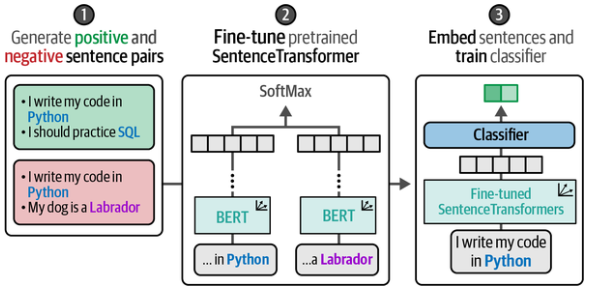

# SetFit

## Description

Efficient Fine-Tuning with a Few Training Examples.

It is built on top of the architecture of sentence-transformers to generate high-quality textual representations that are updated during training. Only a few labeled examples are needed for this framework to be competitive with fine-tuning a BERT-like model on a large labeled dataset.

!!! info

    Not only can SetFit perform few-shot classification tasks, but it also has support for when you have no labels at all, also called zero-shot classification. SetFit generates synthetic examples from the label names to resemble the classification task and then trains a SetFit model on them. For example, if the target labels are “happy” and “sad,” then synthetic data could be “The example is happy” and “This example is sad.”

## Workflow

1. **Sampling training data**: Based on in-class and out-class selection of labeled data it generates positive (similar) and negative (dissimilar) pairs of sentences
2. **Fine-tuning embeddings**: Fine-tuning a pre-trained embedding model based on the previously generated training data.
3. **Training a classifier**: Create a classification head on top of the embedding model and train it using the previously generated training data

