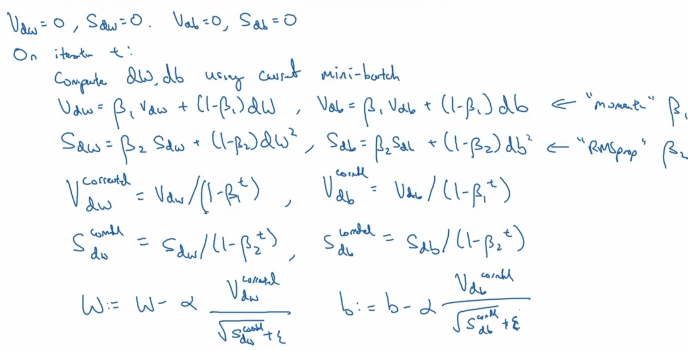

# Adam Algorithm

## Description

طبق یه الگوریتمی تشخیص میده اگر حرکت به سمت نقطه minimum داره صورت میگیره سرعت حرکت رو با افزایش مقدار α بیشتر میکنه در غیر این صورت سرعت رو با کاهش مقدار α کمتر میکنه.

در اصل این تکنیک ترکیبی از تکنیک های Gradient Descent With Momentum و RMS-prop هستش.
