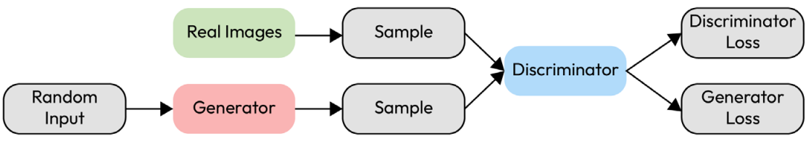

# Generative Adversarial (GAN) [Data Augmentation]

## Description

A GAN consists of two parts, a generator, and a discriminator, which are both neural networks. The generator creates data instances that aim to come from the same distribution as the training dataset. The discriminator's goal is to distinguish between instances from the true distribution and instances from the generator. The generator and the discriminator are trained together, with the goal that the generator produces better instances as training progresses, whereas the discriminator becomes better at distinguishing true instances from generated ones.

