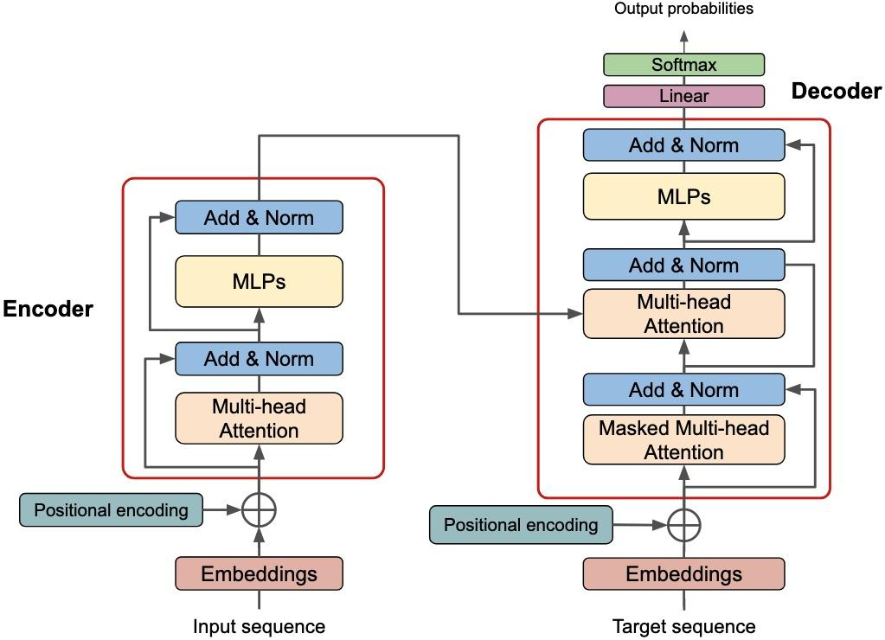

# Transformers [NLP]

## Description

Transformers rely on a mechanism called self-attention, which allows the model to weigh the importance of different parts of the input data dynamically. This enables efficient parallelization and handling of long-range dependencies more effectively than previous models, such as RNNs and LSTMs.

## Components

### Self-Attention Mechanism

Self-Attention: The core mechanism that allows transformers to weigh the importance of different words in a sentence relative to each other. Each word attends to all other words in the sentence to gather context.

Scaled Dot-Product Attention: This involves three matrices - Query (Q), Key (K), and Value (V). The attention scores are calculated as the dot product of the query and key vectors, scaled, and passed through a softmax function to get weights. These weights are then used to combine the value vectors.

### Multi-Head Attention

Instead of performing a single attention function, the model runs multiple attention mechanisms (heads) in parallel. Each head focuses on different parts of the sentence, capturing various aspects of the relationships between words.

### Feed-Forward Neural Network

After the attention mechanism, the output is passed through a position-wise fully connected feed-forward network, which is the same for each position.

### Positional Encoding

Since transformers do not have a sequential nature like RNNs, they need some way to capture the order of words. Positional encodings are added to the input embeddings to give the model information about the position of each word in the sequence.

### Layer Normalization and Residual Connections

Each sub-layer (attention and feed-forward) is followed by a layer normalization and a residual connection to ensure stability during training.

## Vs LLMs

Transformers are a type of neural network architecture that forms the basis for many modern NLP models. Large Language Models (LLMs) are a subset of models that use transformer architectures at a very large scale, resulting in powerful models capable of handling a wide range of tasks with high performance. Essentially, LLMs are built using transformer architectures, but they are distinguished by their size and the vast amount of data they are trained on.
