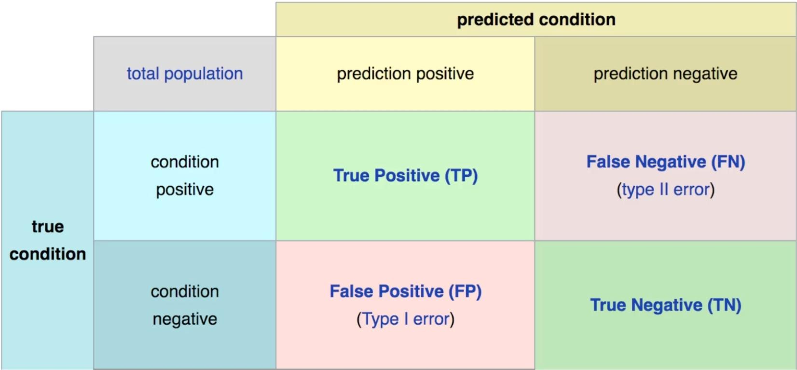
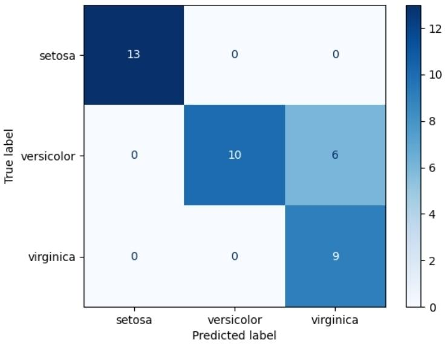
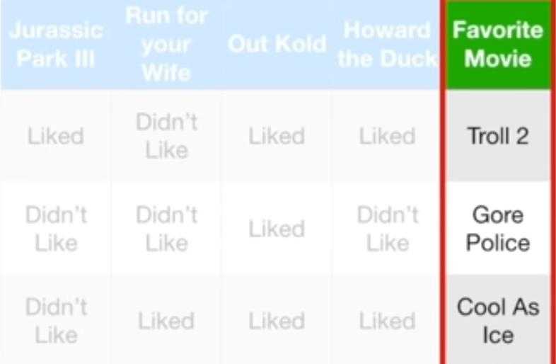

# Confusion Matrix (Error Matrix) [Categorical]

## Description

A confusion matrix is a table that is used to define the performance of a classification algorithm.



- True positive: The real value is T and the predicted value is T
- False positive (type I error): The real value is F but the predicted value is T
- True negative: The real value is F and the predicted value is F
- False negative (type II error): The real value is F but the predicted value is T

A confusion matrix visualizes and summarizes the performance of a classification algorithm.



Is a specific table layout that allows visualization of the performance of an algorithm, typically a supervised learning one (in unsupervised learning it is usually called a matching matrix).
Each row of the matrix represents the instances in an actual class while each column represents the instances in a predicted class, or vice versa – both variants are found in the literature.
The name stems from the fact that it makes it easy to see whether the system is confusing two classes (i.e. commonly mislabeling one as another).

The size of the confusion matrix will be determined by the number of things we want to predict.
For example, in the below table, we will have a 3*3 matrix (Troll 2, Gore Police, Cool As Ice).



## Example

```python
from sklearn.metrics import ConfusionMatrixDisplay

ConfusionMatrixDisplay.from_predictions(y, y_pred, normalize="true", values_format=".0%")
plt.show()
```

!!! info

    - **Matrix Normalization**: Since categories often have unequal sample sizes, it's important to normalize the matrix. This can be achieved by dividing each value by its row sum using the parameter `normalize="true"`
    - **Display Formatting**: To improve readability, display the values as whole percentages (without decimal places) using `values_format=".0%"`
