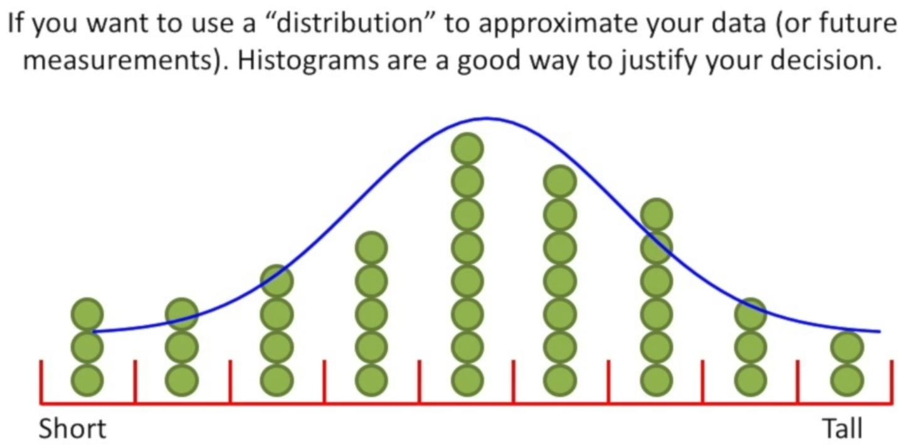

# Histogram [Continuous]

## Description

A histogram is a chart that plots the distribution of a numeric variable's values as a series of bars.
Each bar typically covers a range of numeric values called a bin or class; a bar's height indicates the frequency of data points with a value within the corresponding bin.

For example instead of showing our data like the image below:

We will show it like the below in splitted **bins**:

