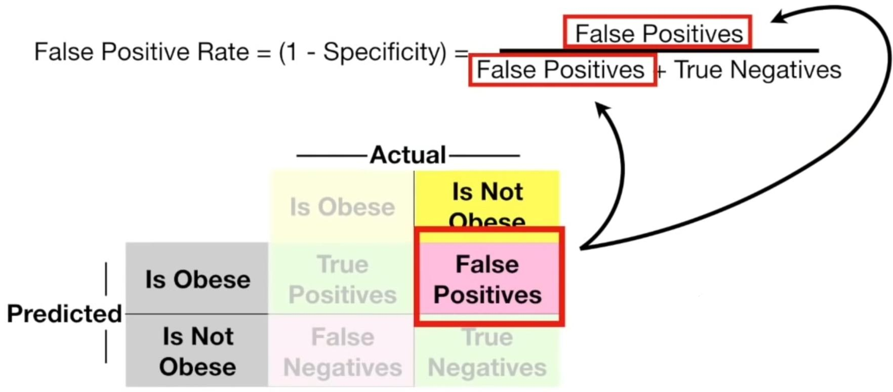

# ROC [Categorical] {AUC}

## Description

A Receiver Operator Characteristic (ROC) curve, is a graphical plot that illustrates the diagnostic ability of a binary classifier system as its discrimination threshold is varied.

The ROC curve is created by plotting the true positive rate (TPR) against the false positive rate (FPR) at various threshold settings.
The true-positive rate is also known as sensitivity, recall or probability of detection.
The false-positive rate is also known as probability of false alarm and can be calculated as (1 − specificity).

## Formula

- The table is calculated by the **confusion matrix** technique
- **True Positives**: numbere of experiments that the algorithm classified them **correctly**
- **False Positives**: numbere of experiments that the algorithm classified them **incorrectly**

## Area Under The Curve (AUC)

AUC makes it easy to compare one ROC curve to another.

