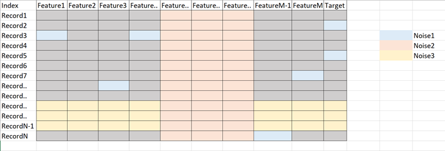

# Cheatsheet

## Description

Noise (in the data science space) is unwanted data items, features or records which don't help in explaining the feature itself, or the relationship between feature & target.
Noise often causes the algorithms to miss out patterns in the data.

Noise in tabular data can be of three types:

- Anomalies in certain data items (Noise1: certain anomalies in features & target)
- Features that don't help in explaining the target (Noise2: irrelevant/weak features)
- Records which don't follow the form or relation which rest of the records do (Noise3: noisy records)

## Noise In Item

We can analyse the features & target and identify the noise in terms of outliers.

Techniques:

- **Outlier detection & treatment**: Either remove the records or put an upper and lower ceiling.

## Noise In Feature

This type of noise is introduced when there are features in the data which are not related to the target or don't help explaining the target.

Techniques:

- **Filter Method**: We can perform various statistical tests between features & responses to identify which features are more relevant than others.

  | Feature\Response | Continuous            | Categorical  |
  |------------------|-----------------------|--------------|
  | Continuous       | Pearson's Correlation | LDA          |
  | Categorical      | Anova                 | Chi-Square   |

*Please note that above methods don't identify or deal with multicollinearity, we need to figure that out separately.*

- **Wrapper Method**: Here we add/remove features to baseline model and compare the performance of the model:

   - forward selection
   - backward elimination
   - recursive elimination

  

- **Embedded Methods (Regularisation)**: This method makes use of the filter & wrapper method, it is implemented using algos which have their own built-in feature selection methods.

  

## Noise In Record

In these methods, we can try to find the set of records which have noise.

Techniques:

- **K-fold Validation**: In this method, we can look at the cross validation score of each fold and analyse the folds which have poor CV scores, what are the common attributes of records having poor scores, etc.

  

- **Manual Method**: Here we can evaluate the CV of each record (predicted vs. actual) and filter/analyse the records having a poor CV score. This will help us in analysing why this is happening in the first place.

  
