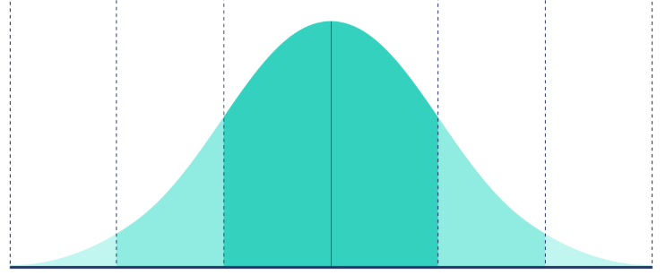

# Normal [Bell Curve] [Gaussian]

## Description

The classic bell-shaped curve, symmetric around the mean, where data clusters around an average value with decreasing probability toward the extremes.

It’s fundamental in statistics because many natural processes and measurement errors approximate this shape due to the Central Limit Theorem.

