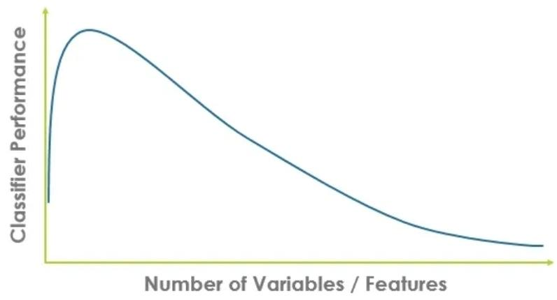

# Overview

## Dimensionality reduction

The curse of dimensionality refers to problems that arise when working with high-dimensional data, such as the need for exponentially more samples to represent all combinations of feature values.

As the number of features increases, more samples are required to adequately represent the data.

Dimensionality reduction transforms high-dimensional data into a lower-dimensional format while preserving important properties.
This reduces model complexity, improves computational efficiency, and helps prevent overfitting due to irrelevant features.

Dimensionality reduction techniques:

- **Wrapper Methods**: Iteratively select feature subsets by training and testing models (e.g., forward selection, backward elimination, recursive feature elimination). These can improve accuracy but are computationally intensive.
- **Linear Dimensionality Reduction**: Transform features into a lower-dimensional linear subspace (best for data that is approximately linear). These methods are simple and efficient.
- **Manifold Dimensionality Reduction**: Uncover nonlinear structures by mapping data to a lower-dimensional manifold. These methods preserve geometric properties and are suited for complex, nonlinear data.
