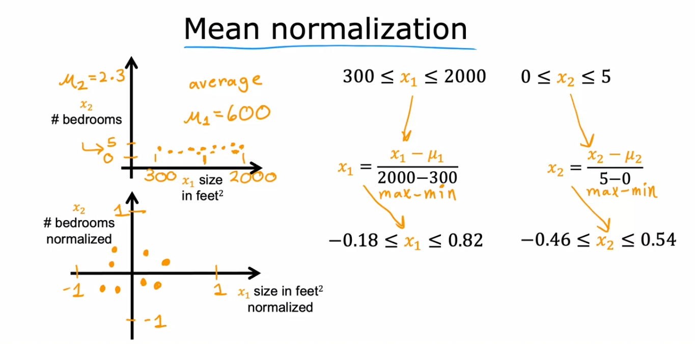
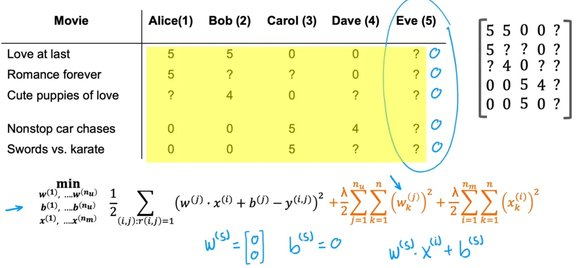
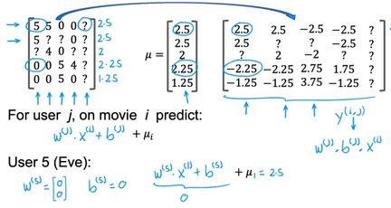

# Mean Normalization

## Formula

$$
x' = \frac{x - \bar{x}}{\max(x) - \min(x)}
$$

where $x$ is an original value, $x'$ is the normalized value, $\bar{x} = \text{average}(x)$

## Example

مقدار $\mu$ برابر است با میانگین اعداد در آن اینپوت (فیچر) خاص

تو دو تصویر بالا نمونه از این تکنیک در الگوریتم Collaborative Filtering میبینیم با اضافه کردن $\mu$ به فرمول محاسبه باعث میشه کسایی که به یه فیلم امتیاز ندادن هم یه عدد اولیه براشون در نظر گرفته بشه.
