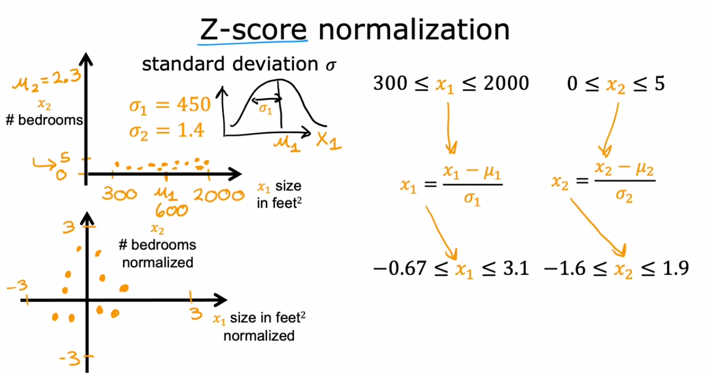

# Standardization (Z-score) {Scaling}

## Description

Z-score normalization refers to the process of normalizing every value in a dataset such that the mean of All the values is 0 and the standard deviation is 1.

This technique transforms the feature values to have a mean of 0 and a standard deviation of 1.
Standardization **is less affected by outliers in the data than min-max scaling**.

## Formula

$$
Z = \frac{x - \mu}{\sigma}
$$

- $Z$ = standard score
- $x$ = observed value
- $\mu$ = mean of the sample
- $\sigma$ = standard deviation of the sample

## Example

مقدار $\sigma$ برابر است با انحراف از معیار (standard deviation)
