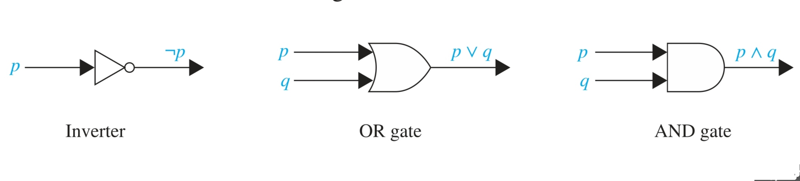
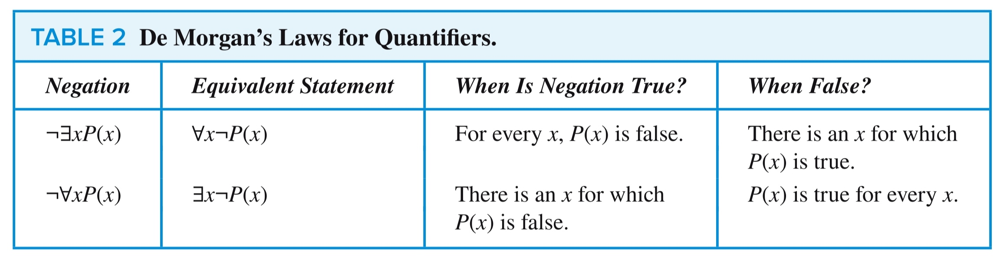

# Logic

## Propositional Logic

### Proposition

Is a declarative sentence (that is, a sentence that declares a fact) that is either true or false, but not both.

### Conjunction

$p \land q$ (and)

### Disjunction

$p \lor q$ (or)

### Exclusive or

The exclusive or of $p$ and $q$, denoted by $p \oplus q$ (or $p$ XOR $q$), is the proposition that is true when exactly one of $p$ and $q$ is true and is false otherwise.

### Conditional Statements

Let $p$ and $q$ be propositions. The conditional statement $p \rightarrow q$ is the proposition “if $p$, then $q$.” The conditional statement $p \rightarrow q$ is false when $p$ is true and $q$ is false, and true otherwise. In the conditional statement $p \rightarrow q$, $p$ is called the hypothesis (or antecedent or premise) and $q$ is called the conclusion (or consequence).

### Biconditional

Let $p$ and $q$ be propositions. The biconditional statement $p \leftrightarrow q$ is the proposition “$p$ if and only if $q$.” The biconditional statement $p \leftrightarrow q$ is true when $p$ and $q$ have the same truth values and is false otherwise. Biconditional statements are also called bi-implications.

### Precedence of Operators

### Logic Circuits

## Propositional Equivalences

### Tautology and Contingency

- A compound proposition that is always true, no matter what the truth values of the propositional variables that occur in it, is called a tautology.
- A compound proposition that is always false is called a contradiction.
- A compound proposition that is neither a tautology nor a contradiction is called a contingency.

### $\equiv$ mark

The compound propositions $p$ and $q$ are called logically equivalent if $p \leftrightarrow q$ is a tautology.

The notation $p \equiv q$ denotes that $p$ and $q$ are logically equivalent.

### De Morgan’s Laws

### Conditional disjunction equivalence

that $p \rightarrow q$ and $\neg p \lor q$ are logically equivalent

### Distributive law of disjunction over conjunction

that $p \lor (q \land r)$ and $(p \lor q) \land (p \lor r)$ are logically equivalent

### Overall

## Predicates and Quantifiers

### Predicate Logic

Statements involving variables, such as

“$x > 3$, $x = y + 3$, $x + y = z$”

and

Computer $X$ is under attack by an intruder

and

“Computer $X$ is functioning properly”

are often found in mathematical assertions, computer programs, and system specifications. These statements are neither true nor false when the values of the variables are not specified. In this section

### Quantifiers

Quantification expresses the extent to which a predicate is true over a range of elements. In English, the words all, some, many, none, and few are used in quantifications. We will focus on two types of quantificationAssessment here: universal quantification, which tells us that a predicate is true for every element under consideration, and existential quantification, which tells us that there is one or more element under consideration for which the predicate is true

- **Universal quantifier:** The universal quantification of $P(x)$ is the statement “$P(x)$ for all values of $x$ in the domain.”

  The notation $\forall x P(x)$ denotes the universal quantification of $P(x)$. Here $\forall$ is called the universal quantifier. We read $\forall x P(x)$ as “for all $x P(x)$” or “for every $x P(x)$.” An element for which $P(x)$ is false is called a counterexample to $\forall x P(x)$.

- **Existential quantifier:** The existential quantification of $P(x)$ is the proposition “There exists an element x in the domain such that P(x).”

  We use the notation $\exists x P(x)$ for the existential quantification of $P(x)$. Here $\exists$ is called the existential quantifier.

- **De Morgan’s Laws for Quantifiers:**

  

## Inference

### Arguments

An argument in propositional logic is a sequence of propositions. All but the final proposition in the argument are called premises and the final proposition is called the conclusion. An argument is valid if the truth of all its premises implies that the conclusion is true.

An argument form in propositional logic is a sequence of compound propositions involving propositional variables. An argument form is valid if no matter which particular propositions are substituted for the propositional variables in its premises, the conclusion is true if the premises are all true.

حاشیه: منظور همان استدلال کردن است، مثلا اگر الف و ب پس پ

حاشیه ۲: در حاشیه بالا الف و ب همان premises هستند و پ همان conclusion 

- **premises:** All but the final proposition in the argument are called
- **conclusion:** the final proposition is called the conclusion.
- **$\therefore$ symbol:** denotes “therefore”

### Rules of Inference

