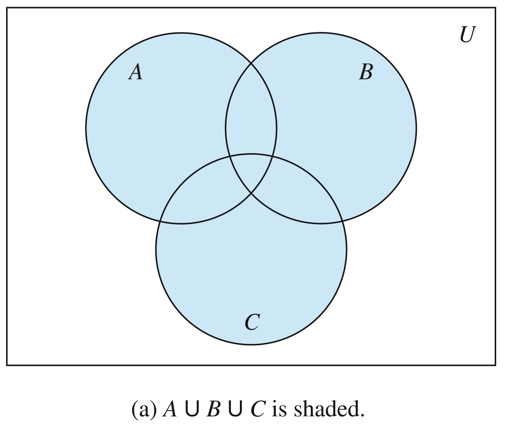
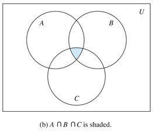

# Sets

## Description

A set is an unordered collection of distinct objects, called elements or members of the set.
A set is said to contain its elements.
We write $a \in A$ to denote that a is an element of the set $A$.
The notation $a \notin A$ denotes that a is not an element of the set $A$.

Popular sets:

- $\mathbb{N} = \{ 0, 1, 2, 3, \ldots \}$, the set of all natural numbers
- $\mathbb{Z} = \{ \ldots, -2, -1, 0, 1, 2, \ldots \}$, the set of all integers
- $\mathbb{Z}^+ = \{ 1, 2, 3, \ldots \}$, the set of all positive integers
- $\mathbb{Q} = \left\{ \frac{p}{q} \ \middle| \ p \in \mathbb{Z}, \ q \in \mathbb{Z}, \ \text{and} \ q \neq 0 \right\}$, the set of all rational numbers
- $\mathbb{R}$, the set of all real numbers
- $\mathbb{R}^+$, the set of all positive real numbers
- $\mathbb{C}$, is the set of all complex numbers

## Subsets

The set $A$ is a subset of $B$, and $B$ is a superset of $A$, if and only if every element of $A$ is also an element of $B$.
We use the notation $A \subseteq B$ to indicate that $A$ is a subset of the set $B$.
If, instead, we want to stress that $B$ is a superset of $A$, we use the equivalent notation $B \supseteq A$.(So, $A \subseteq B$ and $B \supseteq A$ are equivalent statements.)

## Operations

### Cartesian Products

Let $A$ and $B$ be sets.
The Cartesian product of $A$ and $B$, denoted by $A \times B$, is the set of all ordered pairs $(a, b)$, where $a \in A$ and $b \in B$.
Hence,

$A \times B = \{ (a, b) \mid a \in A \land b \in B \}$

### Union

Let $A$ and $B$ be sets.
The union of the sets $A$ and $B$, denoted by $A \cup B$, is the set that contains those elements that are either in $A$ or in $B$, or in both.

### Intersection

Let $A$ and $B$ be sets.
The intersection of the sets $A$ and $B$, denoted by $A \cap B$, is the set containing those elements in both $A$ and $B$.

### Difference

Let $A$ and $B$ be sets.
The difference of $A$ and $B$, denoted by $A - B$, is the set containing those elements that are in $A$ but not in $B$.
The difference of $A$ and $B$ is also called the complement of B with respect to $A$.

### Complement

Let $U$ be the universal set.
The complement of the set $A$, denoted by $-A$, is the complement of $A$ with respect to $U$.
Therefore, the complement of the set $-A$ is $U - A$

### Identities

| Identity                                                                                               | Name                |
|--------------------------------------------------------------------------------------------------------|---------------------|
| $A \cap U = A$   $A \cup \emptyset = A$                                                             | Identity laws       |
| $A \cup U = U$   $A \cap \emptyset = \emptyset$                                                     | Domination laws     |
| $A \cup A = A$   $A \cap A = A$                                                                     | Idempotent laws     |
| $\overline{(\bar{A})} = A$                                                                             | Complementation law |
| $A \cup B = B \cup A$   $A \cap B = B \cap A$                                                       | Commutative laws    |
| $A \cup (B \cup C) = (A \cup B) \cup C$   $A \cap (B \cap C) = (A \cap B) \cap C$                   | Associative laws    |
| $A \cup (B \cap C) = (A \cup B) \cap (A \cup C)$   $A \cap (B \cup C) = (A \cap B) \cup (A \cap C)$ | Distributive laws   |
| $\overline{A \cap B} = \bar{A} \cup \bar{B}$   $\overline{A \cup B} = \bar{A} \cap \bar{B}$         | De Morgan's laws    |
| $A \cup (A \cap B) = A$   $A \cap (A \cup B) = A$                                                   | Absorption laws     |
| $A \cup \bar{A} = U$   $A \cap \bar{A} = \emptyset$                                                 | Complement laws     |
