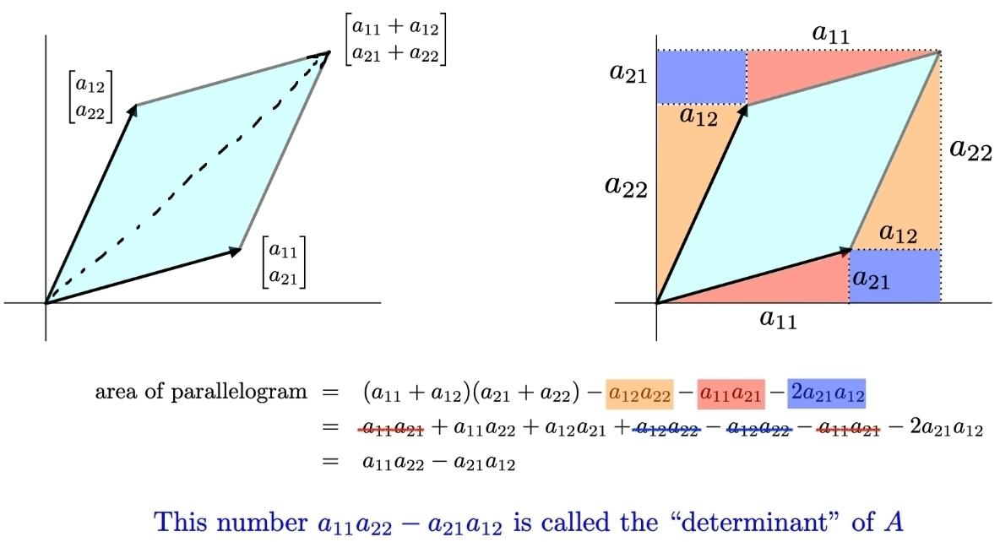

# Matrix

## Description

- A **scalar** is a number, like 3, -5, 0.368, etc.
- A **vector** is a list of numbers (can be in a row or column),
- A **matrix** is an array of numbers (one or more rows, one or more columns).

Row vector:

$$
\begin{bmatrix} 2 & -8 & 7 \end{bmatrix}
$$

Column vector:

$$
\begin{bmatrix}
2 \\
-8 \\
7
\end{bmatrix}
$$

Matrix:

$$
\begin{bmatrix}
6 & 4 & 24 \\
1 & -9 & 8
\end{bmatrix}
$$

We can show a matrix with multiple vectors:

$$
A =
\begin{bmatrix}
a_{11} & a_{12} & \cdots & a_{1n} \\
a_{21} & a_{22} & \cdots & a_{2n} \\
\vdots & \vdots & \ddots & \vdots \\
a_{m1} & a_{m2} & \cdots & a_{mn}
\end{bmatrix}
$$

$$
A =
\begin{bmatrix}
\vec{v}_1 & \vec{v}_2 & \cdots & \vec{v}_n
\end{bmatrix}
$$

## Operations

### Multiplication With Another Matrix

We will use this for transformation composition, like this:

$(f \circ g)(\vec{x}) = f(g(a)) = f(Ax) = B(Ax) = BA(x)$

### Multiplication With Vector (Matrix-Vector Product)

In general, each vector $\begin{bmatrix} x \\ y \end{bmatrix}$ can be broken down as follows:

$$
\begin{bmatrix}x \\ y \end{bmatrix} = x \begin{bmatrix} 1 \\ 0 \end{bmatrix} + y \begin{bmatrix} 0 \\ 1 \end{bmatrix}
$$

So, if the green arrow $\begin{bmatrix} 1 \\ 0 \end{bmatrix}$ lands on some vector $\begin{bmatrix} a \\ c \end{bmatrix}$ and the red arrow $\begin{bmatrix} 0 \\ 1 \end{bmatrix}$ lands on some vector $\begin{bmatrix} b \\ d \end{bmatrix}$, then the vector $\begin{bmatrix} x \\ y \end{bmatrix}$ must land on

$$
x \cdot \begin{bmatrix} a \\ c \end{bmatrix} + y \cdot \begin{bmatrix} b \\ d \end{bmatrix} = \begin{bmatrix} ax + by \\ cx + dy \end{bmatrix}.
$$

A really nice way to describe all this is to represent a given linear transform with the matrix below:

$$
\mathbf{A} = \begin{bmatrix} a & b \\ c & d \end{bmatrix}
$$

In this matrix, the first *column* tells us where $\begin{bmatrix} 1 \\ 0 \end{bmatrix}$ lands, and the second *column* tells us where $\begin{bmatrix} 0 \\ 1 \end{bmatrix}$ lands. Now we can describe where any vector $\mathbf{v} = \begin{bmatrix} x \\ y \end{bmatrix}$ lands very compactly as the matrix-vector product

$$
\mathbf{Av} = \begin{bmatrix} ax + by \\ cx + dy \end{bmatrix}.
$$

In fact, this is where the definition of a matrix-vector product comes from.

Matrix-vector product is always a linear transformation.

### Transpose

$$
A =
\begin{bmatrix}
a & b & c \\
d & e & f
\end{bmatrix}_{2 \times 3}
\hspace{1cm}
A^T =
\begin{bmatrix}
a & d \\
b & e \\
c & f
\end{bmatrix}_{3 \times 2}
$$

### Reduced Row Echelon Form (RREF)

### Determinant

The determinant of a $2 \times 2$ matrix is

$$
\begin{vmatrix}
a & b \\
c & d
\end{vmatrix}
= ad - bc
$$

And the determinant of a $3 \times 3$ matrix is

$$
\begin{vmatrix}
a & b & c \\
d & e & f \\
g & h & i
\end{vmatrix}
= aei + bfg + cdh - ceg - bdi - afh
$$

- The determinant is nonzero if and only if the matrix is invertible and the linear map represented by the matrix is an isomorphism.
- The determinant of a matrix is equal to the determinant of its transpose

## Null Space

The null space of any matrix $A$ consists of all the vectors $B$ such that $AB = 0$ and $B$ is not zero.

We will show the null space of $\mathbf{A}$ with $N(\mathbf{A})$.

$$
N(A) = \left\{ \vec{x} \in \mathbb{R}^n \mid A\vec{x} = \vec{0} \right\}
$$

- It can also be thought of as the solution obtained from $AB=0$ where $A$ is a known matrix of size $m x n$ and $B$ is a matrix to be found of size $n x k$.
- $N(\mathbf{A}) = N(RREF(\mathbf{A}))$

## Column Space

We will show the columnspace of $\mathbf{A}$ with $C(\mathbf{A})$.

$$
A =
\begin{bmatrix}
1 & 1 & 1 & 1 \\
2 & 1 & 4 & 3 \\
3 & 4 & 1 & 2
\end{bmatrix}
$$

$$
C(A) = \text{span}
\left(
\begin{bmatrix}
1 \\
2 \\
3
\end{bmatrix},
\begin{bmatrix}
1 \\
1 \\
4
\end{bmatrix},
\begin{bmatrix}
1 \\
4 \\
1
\end{bmatrix},
\begin{bmatrix}
1 \\
3 \\
2
\end{bmatrix}
\right)
$$

## Identity Matrix

$I_1 = [1], I_2 = \begin{bmatrix} 1 & 0 \\ 0 & 1 \end{bmatrix}, I_3 = \begin{bmatrix} 1 & 0 & 0 \\ 0 & 1 & 0 \\ 0 & 0 & 1 \end{bmatrix}, \dots, I_n = \begin{bmatrix} 1 & 0 & 0 & \cdots & 0 \\ 0 & 1 & 0 & \cdots & 0 \\ 0 & 0 & 1 & \cdots & 0 \\ \vdots & \vdots & \vdots & \ddots & \vdots \\ 0 & 0 & 0 & \cdots & 1 \end{bmatrix}$
