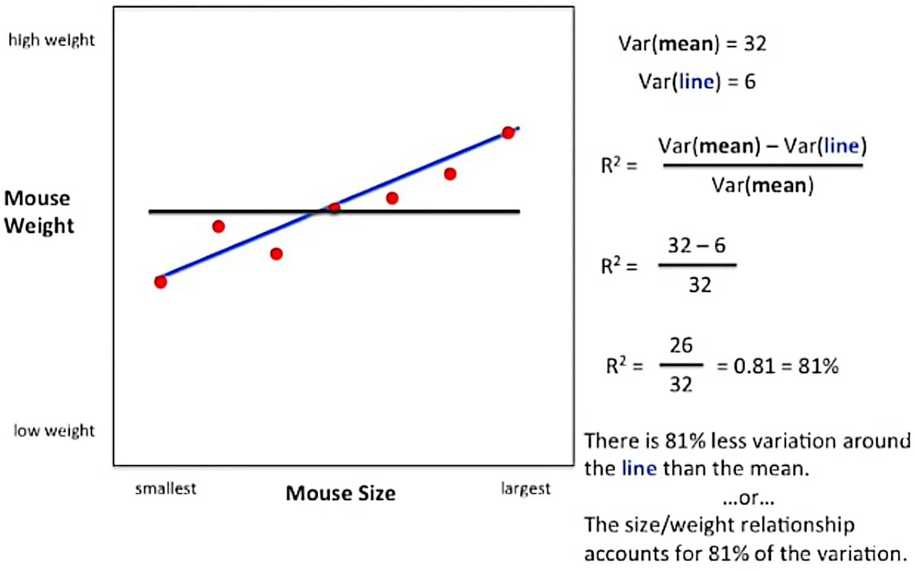

# Pearson Correlation Coefficient ($R$)

## Description

The values of the **Pearson Correlation Coefficient ($R$)** can range from -1 to +1.
The closer it is to +1 or -1, the more closely the two variables are related.
The positive sign signifies the direction of the correlation (i.e. if one of the variables increases, the other variable is also supposed to increase).

- Correlation coefficients lie between -1 and +1
- The value of correlation is not influenced by the change in scale of the values.

## Formula

We obtain the correlation coefficient by dividing the covariance of the two variables by the product of their standard deviations.

$$
corr(x, y) = \frac{cov(x, y)}{s_x s_y}
$$

Or in another way:

$$
r = \frac{\sum (x_i - \bar{x})(y_i - \bar{y})}{\sqrt{\sum (x_i - \bar{x})^2 \sum (y_i - \bar{y})^2}}
$$

- $r$ = correlation coefficient
- $x_i$ = values of the $x$-variable in a sample
- $\bar{x}$ = mean of the values of the $x$-variable
- $y_i$ = values of the $y$-variable in a sample
- $\bar{y}$ = mean of the values of the $y$-variable

## Coefficient of Determination ($R^2$)

The **coefficient of determination ($R^2$)** measures the percentage of variability within the values that can be explained by the regression model.
Therefore, a value close to 100% means that the model is useful and a value close to zero indicates that the model is not useful.

## $R$ vs $R^2$

- The Pearson correlation coefficient ($R$) is used to identify patterns in things.
- The coefficient of determination ($R^2$) is used to identify the strength of a model.

I like $R^2$ more than just plain old $R$ because it is easier to interpret.
How much better is $R = 0.7$ than $R = 0.5$?
Well, if we convert those numbers to $R^2$, we see that:

$R^2 = 0.7^2 = 0.5$ (50% of the original variation is explained)

$R^2 = 0.5^2 = 0.25$ (25% of the original variation is explained)

With $R^2$, it is easy to see that the first correlation is twice as good as the second.
