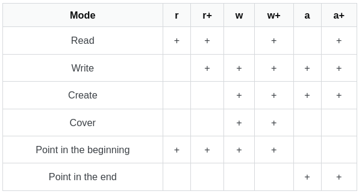
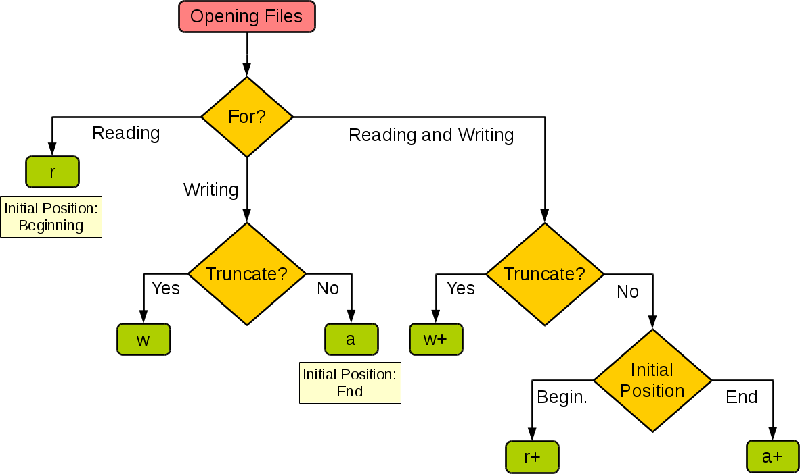
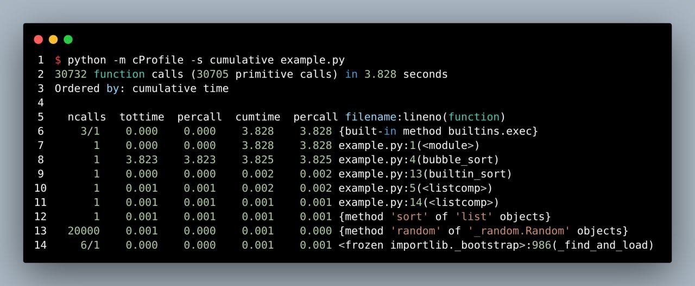

# Python

## Links

- [Force Restart Faild Gunicor Service](https://unix.stackexchange.com/questions/513972/how-to-fix-start-limit-hit-trying-to-start-gunicorn-on-ubuntu-18#answer-552135)
- [Cookiecutter Django](https://github.com/pydanny/cookiecutter-django)
- [Django Language Codes](https://stackoverflow.com/questions/59156630/translation-e004-you-have-provided-a-value-for-the-language-code-setting-that-i#answer-59157763)
- [All Language Codes](http://www.i18nguy.com/unicode/language-identifiers.html)
- [Django Reverse Many2Many Inline Admin](https://stackoverflow.com/questions/10904848/adding-inline-many-to-many-objects-in-django-admin)
- [Django <=> Python](https://docs.djangoproject.com/en/dev/faq/install/#what-python-version-can-i-use-with-django)
- [Django Value Sensitive Unique Together](https://stackoverflow.com/questions/16474552/is-there-any-more-elegant-way-to-add-a-value-sensitive-unique-together-constrain#answer-59939626)
- [DRF Serialzer Write Only Fields](https://stackoverflow.com/questions/34989915/write-only-read-only-fields-in-django-rest-framework#answer-36771366)
- [Locale Error: Unsupported Locale Setting](https://stackoverflow.com/questions/14547631/python-locale-error-unsupported-locale-setting#answer-14548156)
- [Locale Problem In Docker](https://serverfault.com/questions/54591/how-to-install-change-locale-on-debian#answer-894545)
- [Celery Timezones Types](https://stackoverflow.com/questions/13866926/is-there-a-list-of-pytz-timezones)
- [Python Dates Types](https://www.w3schools.com/python/python_datetime.asp)
- [Convert Python File To .Exe](https://m.youtube.com/watch?feature=youtu.be&v=UZX5kH72Yx4)
- [Time Complexity (Big O)](https://wiki.python.org/moin/TimeComplexity)
- [Number of Gunicorn Workers In Kubernetes](https://forum.djangoproject.com/t/gunicorn-workers-in-kubernetes/7918/2)
- [3rd-Party python profiler](https://github.com/plasma-umass/scalene)

## File

- Open modes:

  

- Open modes decision tree:

  

## Class & Function

- Get full path:

  ```python
  import os
  import inspect

  def foo():
    pass

  print(os.path.abspath(inspect.getfile(foo)))

  class Bar:
    pass

  print(os.path.abspath(inspect.getfile(Bar.__class__)))
  ```

## Modules & Packages

- Get all import able modules & packages:

  ```python
  import pkgutil
  search_path = ['.'] # set to None to see all modules importable from sys.path
  all_modules = [x[1] for x in pkgutil.iter_modules(path=search_path)]
  print(all_modules)
  ```

## Celery

- Kill celery process:

  ```shell
  kill -9 $(ps aux | grep celery | grep -v grep | awk '{print $2}' | tr '\n' ' ') > /dev/null 2>&1
  ```

- View worker logs:

  ```shell
  celery -A <worker name: karestoon> worker --loglevel=info
  ```

## Pip

- Install from source (Unix path):

  ```shell
  pip install <package-name> --no-index --find-links file:///path/to/package
  ```

## Other

- cProfile example:

  
