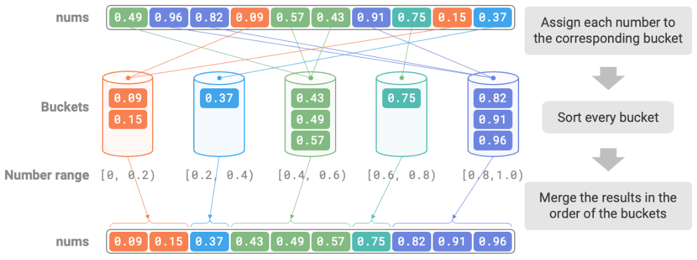

# Bucket Sort [$O(n + k)$] [Stable] [Non-In-Place]

## Description

Bucket sort is a typical application of the divide-and-conquer strategy.
It works by setting up a series of ordered buckets, each containing a range of data, and distributing the input data evenly across these buckets.
And then, the data in each bucket is sorted individually.
Finally, the sorted data from all the buckets is merged in sequence to produce the final result.

!!! info

    Bucket sort is suitable for handling very large data sets. For example, if the input data includes 1 million elements, and system memory limitations prevent loading all the data at the same time, you can divide the data into 1,000 buckets and sort each bucket separately before merging the results.

## Workflow

Consider an array of length $n$, with float numbers in the range $[0, 1)$.

1. Initialize $k$ buckets and distribute $n$ elements into these $k$ buckets.
2. Sort each bucket individually (using the built-in sorting function of the programming language).
3. Merge the results in the order from the smallest to the largest bucket.

## Specifications

- **Time complexity is $O(n + k)$**: Assuming the elements are evenly distributed across the buckets, the number of elements in each bucket is $n/k$. Assuming sorting a single bucket takes $O(n/k \log(n/k))$ time, sorting all buckets takes $O(n \log(n/k))$ time. **When the number of buckets $k$ is relatively large, the time complexity approaches $O(n)$**. Merging the results requires traversing all buckets and elements, taking $O(n + k)$ time. In the worst case, all data is distributed into a single bucket, and sorting that bucket takes $O(n^2)$ time.
- **Space complexity is $O(n + k)$, non-in-place sorting**: It requires additional space for $k$ buckets and a total of $n$ elements.
- **Stable sorting**: Whether bucket sort is stable depends on whether the sorting algorithm used within each bucket is stable.
