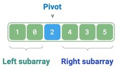

# Quick Sort * [$O(n \log n)$] [Non-Stable] [In-Place]

## Description

Quick sort is a sorting algorithm based on the divide-and-conquer strategy, known for its efficiency and wide application.

The core operation of quick sort is "pivot partitioning," which aims to select an element from the array as the "pivot" and move all elements less than the pivot to its left side, while moving all elements greater than the pivot to its right side.

## Workflow

=== "Overview"

    1. First, perform a "pivot partitioning" on the original array to obtain the unsorted left and right sub-arrays.
    2. Then, recursively perform "pivot partitioning" on the left and right sub-arrays separately.
    3. Continue recursively until the length of sub-array is 1, thus completing the sorting of the entire array.

    

=== "<1>"

    

=== "<2>"

    

=== "<3>"

    

=== "<4>"

    

=== "<5>"

    

=== "<6>"

    

=== "<7>"

    

=== "<8>"

    

=== "<9>"

    

=== "Pivot Partitioning"

    1. Select the leftmost element of the array as the pivot, and initialize two pointers `i` and `j` to point to the two ends of the array respectively.
    2. Set up a loop where each round uses `i` (`j`) to search for the first element larger (smaller) than the pivot, then swap these two elements.
    3. Repeat step `2.` until `i` and `j` meet, finally swap the pivot to the boundary between the two sub-arrays.

    After the pivot partitioning, the original array is divided into three parts: left sub-array, pivot, and right sub-array:

    

    !!! info

        The essence of pivot partitioning is to simplify the sorting problem of a longer array into two shorter arrays.

## Specifications

- **Time complexity of $O(n \log n)$, non-adaptive sorting**:

    - The recursive levels of pivot partitioning are $O(\log n)$
    - The total number of loops per level is $O(n)$
    - With $O(\log n)$ levels and $O(n)$ loops at each level, the total is $O(n \log n)$ time

- **Space complexity of $O(n)$, in-place sorting**:

    - Worst case: When the input array is completely reversed, the worst recursive depth reaches $n$
    - Space usage: This uses $O(n)$ stack frame space
    - In-place operations: The sorting operation is performed on the original array without additional arrays

- **Non-stable sorting**: In the final step of pivot partitioning, the pivot may be swapped to the right of equal elements.
