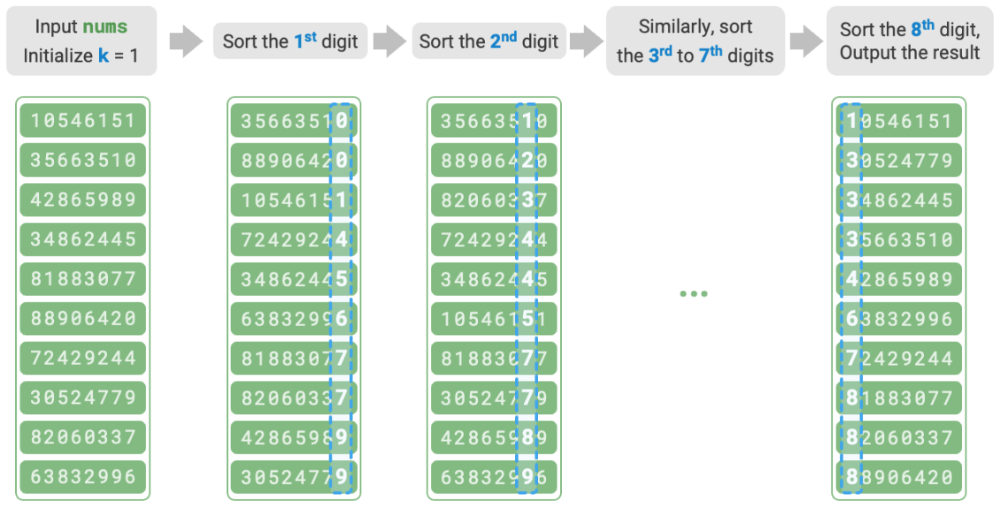

# Radix Sort [$O(nk)$] [Stable] [Non-In-Place]

## Description

Radix sort shares the same core concept as counting sort, which also sorts by counting the frequency of elements.
Meanwhile, radix sort builds upon this by utilizing the progressive relationship between the digits of numbers.
It processes and sorts the digits one at a time, achieving the final sorted order.

!!! info

    Counting sort is suitable for scenarios where the data size $n$ is large but the data range $m$ is small. Suppose we need to sort $n = 10^6$ student IDs, where each ID is an $8$-digit number. This means the data range $m = 10^8$ is very large. Using counting sort in this case would require significant memory space. Radix sort can avoid this situation.

!!! info

    Compared to counting sort, radix sort is suitable for larger numerical ranges, **but it assumes that the data can be represented in a fixed number of digits, and the number of digits should not be too large**. For example, floating-point numbers are unsuitable for radix sort, as their digit count $k$ may be large, potentially leading to a time complexity $O(nk) \gg O(n^2)$.

## Workflow

Taking the student ID data as an example, assume the least significant digit is the $1^{st}$ and the most significant is the $8^{th}$, the radix sort process is illustrated in the figure below.

1. Initialize digit $k = 1$.
2. Perform "counting sort" on the $k^{th}$ digit of the student IDs. After completion, the data will be sorted from smallest to largest based on the $k^{th}$ digit.
3. Increment $k$ by $1$, then return to step `2.` and continue iterating until all digits have been sorted, at which point the process ends.

## Specifications

- **Time complexity is $O(nk)$, non-adaptive sorting**:

    - Assume data size is $n$, data is in base $d$, and maximum number of digits is $k$
    - Sorting a single digit takes $O(n + d)$ time
    - Sorting all $k$ digits takes $O((n + d)k)$ time
    - When $d = O(1)$ (e.g., base 10, base 256), this simplifies to $O(nk)$
    - Best case: $d$ and $k$ are relatively small, leading to time complexity approaching $O(n)$

- **Space complexity is $O(n + d)$, non-in-place sorting**: Like counting sort, radix sort relies on arrays `res` and `counter` of lengths $n$ and $d$ respectively.
- **Stable sorting**: When counting sort is stable, radix sort is also stable; if counting sort is unstable, radix sort cannot ensure a correct sorting order.
