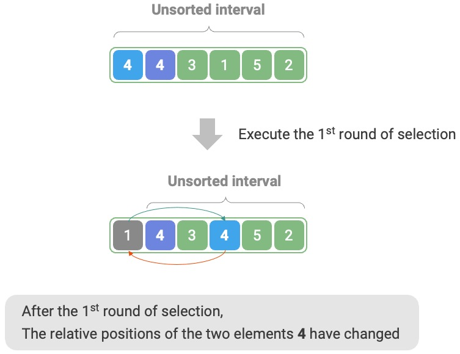

# Selection Sort [$O(n^2)$] [Non-Stable] [In-Place]

## Description

Selection sort works on a very simple principle: it uses a loop where each iteration selects the smallest element from the unsorted interval and moves it to the end of the sorted section.

## Workflow

Suppose the length of the array is $n$, the steps of selection sort are:

1. Initially, all elements are unsorted, i.e., the unsorted (index) interval is $[0, n - 1]$.
2. Select the smallest element in the interval $[0, n - 1]$ and swap it with the element at index 0. After this, the first element of the array is sorted.
3. Select the smallest element in the interval $[1, n - 1]$ and swap it with the element at index 1. After this, the first two elements of the array are sorted.
4. Continue in this manner. After $n - 1$ rounds of selection and swapping, the first $n - 1$ elements are sorted.
5. The only remaining element is subsequently the largest element and does not need sorting, thus the array is sorted.

=== "<1>"

    

=== "<2>"

    

=== "<3>"

    

=== "<4>"

    

=== "<5>"

    

=== "<6>"

    

=== "<7>"

    

=== "<8>"

    

=== "<9>"

    

=== "<10>"

    

=== "<11>"

    

## Specifications

- **Time complexity is $O(n^2)$, non-adaptive sorting**:

    - Total of $n - 1$ outer loop iterations (the unsorted section shrinks by 1 per round)
    - Each outer loop iteration contains $n, n-1, \ldots, 3, 2$ inner loop iterations respectively
    - Summing up to $\frac{(n-1)(n+2)}{2}$
    - The expression $\frac{(n-1)(n+2)}{2} = \frac{n^2 + n - 2}{2}$ is dominated by the $n^2$ term, so we denote it as $O(n^2)$ time

- **Space complexity of $O(1)$, in-place sort**: Uses constant extra space with pointers $i$ and $j$.
- **Non-stable sort**: As shown in the following picture, an element `nums[i]` may be swapped to the right of an equal element, causing their relative order to change.

