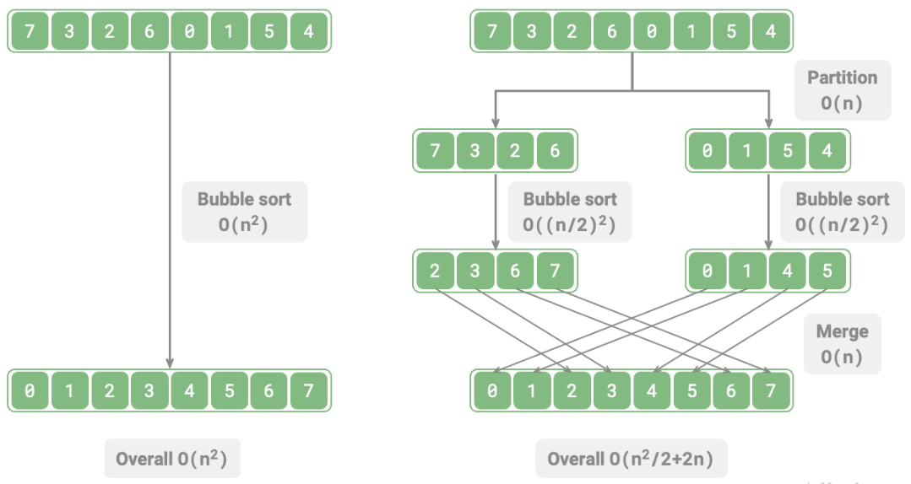
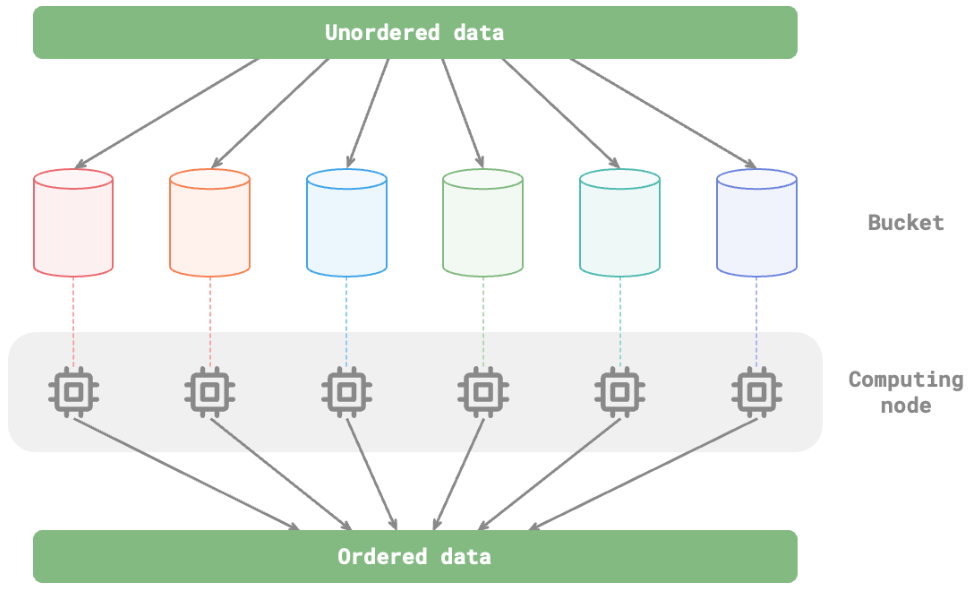

# Divide & Conquer [Top-Down] [Recursion]

## Description

Divide and conquer is an important and popular algorithm strategy.
As the name suggests, the algorithm is typically implemented recursively and consists of two steps: "divide" and "conquer".

1. **Divide (partition phase)**: Recursively break down the original problem into two or more smaller sub-problems until the smallest sub-problem is reached.
2. **Conquer (merge phase)**: Starting from the smallest sub-problem with known solution, we construct the solution to the original problem by merging the solutions of sub-problems in a bottom-up manner.

!!! info

    The divide-and-conquer strategy not only effectively solves algorithm problems but also often enhances efficiency. In sorting algorithms, quick sort, merge sort, and heap sort are faster than selection sort, bubble sort, and insertion sort because they apply the divide-and-conquer strategy.

!!! info

    We may have a question in mind: **Why can divide and conquer improve algorithm efficiency, and what is the underlying logic?** In other words, why is breaking a problem into sub-problems, solving them, and combining their solutions to address the original problem offer more efficiency than directly solving the original problem? This question can be analyzed from two aspects: operation count and parallel computation.

## Workflow

=== "Optimization of Operation Count"

    Taking "bubble sort" as an example, it requires $O(n^2)$ time to process an array of length $n$.
    Suppose we divide the array from the midpoint into two sub-arrays as shown in the figure below, such division requires $O(n)$ time.
    Sorting each sub-array requires $O((n / 2)^2)$ time.
    And merging the two sub-arrays requires $O(n)$ time.
    Thus, the overall time complexity is:

    $$
    O(n + (\frac{n}{2})^2 \times 2 + n) = O(\frac{n^2}{2} + 2n)
    $$

    

    Let's calculate the following inequality, where the left side represents the total number of operations before division and the right side represents the total number of operations after division, respectively:

    $$
    \begin{aligned}
    n^2 & > \frac{n^2}{2} + 2n \newline
    n^2 - \frac{n^2}{2} - 2n & > 0 \newline
    n(n - 4) & > 0
    \end{aligned}
    $$

    **This means that when $n > 4$, the number of operations after partitioning is fewer, leading to better performance**.
    Please note that the time complexity after partitioning is still quadratic $O(n^2)$, but the constant factor in the complexity has decreased.

    !!! info

        We can go even further. **How about keeping dividing the sub-arrays from their midpoints into two sub-arrays** until the sub-arrays have only one element left? This idea is actually "merge sort," with a time complexity of $O(n \log n)$.

    !!! info

        Let's try something a bit different again. **How about splitting into more partitions instead of just two?** For example, we evenly divide the original array into $k$ sub-arrays? This approach is very similar to "bucket sort," which is very suitable for sorting massive data. Theoretically, the time complexity can reach $O(n + k)$.

=== "Optimization Through Parallel Computation"

    We know that the sub-problems generated by divide and conquer are independent of each other, **which means that they can be solved in parallel.** As a result, divide and conquer not only reduces the algorithm's time complexity, **but also facilitates parallel optimization by modern operating systems.**

    Parallel optimization is particularly effective in environments with multiple cores or processors.
    As the system can process multiple sub-problems simultaneously, fully utilizing computing resources, the overall runtime is significantly reduced.

    For example, in the "bucket sort" shown in the figure below, we break massive data evenly into various buckets.
    The jobs of sorting each bucket can be allocated to available computing units.
    Once all jobs are done, all sorted buckets are merged to produce the final result.

    

## Use Cases

=== "When to Use"

    Whether a problem is suitable for a divide-and-conquer solution can usually be decided based on the following criteria.

    1. **The problem can be broken down into smaller ones**: The original problem can be divided into smaller, similar sub-problems and such process can be recursively done in the same manner.
    2. **Sub-problems are independent**: There is no overlap between sub-problems, and they are independent and can be solved separately.
    3. **Solutions to sub-problems can be merged**: The solution to the original problem is derived by combining the solutions of the sub-problems.

=== "Solving Algorithm Problems"

    - **Finding the closest pair of points**: This algorithm works by dividing the set of points into two halves. Then it recursively finds the closest pair in each half. Finally it considers pairs that span the two halves to find the overall closest pair.
    - **Large integer multiplication**: One algorithm is called Karatsuba. It breaks down large integer multiplication into several smaller integer multiplications and additions.
    - **Matrix multiplication**: One example is the Strassen algorithm. It breaks down a large matrix multiplication into multiple small matrix multiplications and additions.
    - **Tower of Hanoi problem**: The Tower of Hanoi problem can be solved recursively, a typical application of the divide-and-conquer strategy.
    - **Solving inversion pairs**: In a sequence, if a preceding number is greater than a following number, then these two numbers constitute an inversion pair. Solving inversion pair problem can utilize the idea of divide and conquer, with the aid of merge sort.

=== "Algorithms & Data Structures"

    - **Binary search**: Binary search divides a sorted array into two halves from the midpoint index. And then based on the comparison result between the target value and the middle element value, one half is discarded. The search continues on the remaining half with the same process until the target is found or there is no remaining element.
    - **Merge sort**: Already introduced at the beginning of this section, no further elaboration is needed.
    - **Quicksort**: Quicksort picks a pivot value to divide the array into two sub-arrays, one with elements smaller than the pivot and the other with elements larger than the pivot. Such process goes on against each of these two sub-arrays until they hold only one element.
    - **Bucket sort**: The basic idea of bucket sort is to distribute data to multiple buckets. After sorting the elements within each bucket, retrieve the elements from the buckets in order to obtain an ordered array.
    - **Trees**: For example, binary search trees, AVL trees, red-black trees, B-trees, and B+ trees, etc. Their operations, such as search, insertion, and deletion, can all be regarded as applications of the divide-and-conquer strategy.
    - **Heap**: A heap is a special type of complete binary tree. Its various operations, such as insertion, deletion, and heapify, actually imply the idea of divide and conquer.
    - **Hash table**: Although hash tables do not directly apply divide and conquer, some hash collision resolution solutions indirectly apply the strategy. For example, long lists in chained addressing may be converted to red-black trees to improve query efficiency.

## Example

!!! question

    Given an ordered array `nums` of length n, where all elements are unique, please find the element `target`.

```python
def dfs(nums: list[int], target: int, i: int, j: int) -> int:
    if i > j:
        return -1  # If the interval is empty, indicating no target element, return -1

    m = (i + j) // 2  # Calculate midpoint index m
    if nums[m] < target:
        return dfs(nums, target, m + 1, j)  # Recursive subproblem f(m+1, j)
    elif nums[m] > target:
        return dfs(nums, target, i, m - 1)  # Recursive subproblem f(i, m-1)
    else:
        return m  # Found the target element, thus return its index

def binary_search(nums: list[int], target: int) -> int:
    n = len(nums)
    return dfs(nums, target, 0, n - 1)  # Solve problem f(0, n-1)
```


