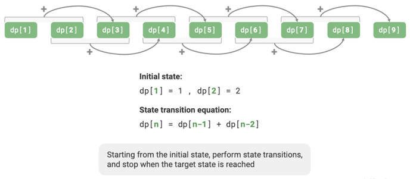

# Dynamic Programming [Medium] [Bottom-Up] [Loop]

## Description

Dynamic programming is an important algorithmic paradigm that decomposes a problem into a series of smaller subproblems, and stores the solutions of these subproblems to avoid redundant computations, thereby significantly improving time efficiency.

!!! info

    Dynamic programming is a bottom-up method: starting with the solutions to the smallest subproblems, it iteratively constructs the solutions to larger subproblems until the original problem is solved.

## Workflow

The dynamic programming problem-solving process varies with the nature and difficulty of the problem but generally follows these steps:

1. Describe decisions.
2. Define states.
3. Establish a $dp$ table.
4. Derive state transition equations.
5. Determine boundary conditions, etc.



## Use Cases

Dynamic programming is commonly used to solve optimization problems, which not only include overlapping subproblems but also have two other major characteristics: optimal substructure and statelessness.

=== "When to Use"

    If the problem contains explicit **decision concepts**, and the solution is produced through a series of decisions, then it fits the decision tree model and can usually be solved using Backtracking or Dynamic Programming.

    On this basis, there are some "bonus points" for determining dynamic programming problems.

    - The problem contains descriptions of maximization (minimization) or finding the most (least) optimal solution.
    - The problem's states can be represented using a list, multi-dimensional matrix, or tree, and a state has a recursive relationship with its surrounding states.

    Correspondingly, there are also some "penalty points".

    - The goal of the problem is to find all possible solutions, not just the optimal solution.
    - The problem description has obvious characteristics of permutations and combinations, requiring the return of specific multiple solutions.

    If a problem fits the decision tree model and has relatively obvious "bonus points", we can assume it is a dynamic programming problem and verify it during the solution process.

=== "Optimal Substructure"

    The optimal solution to the original problem is constructed from the optimal solutions of subproblems. This means:

    1. The problem can be broken down into smaller subproblems
    2. The optimal solution to the original problem contains optimal solutions to its subproblems
    3. Solutions to subproblems can be combined to form the solution to the larger problem

    For example, in the climbing stairs problem:

    - To find the number of ways to climb n stairs
    - We need the optimal solutions for (n-1) and (n-2) stairs
    - The total number of ways is the sum of these two subproblem solutions
    - Each subproblem solution is itself optimal and independent

=== "Statelessness"

    Statelessness is one of the important characteristics that make dynamic programming effective in solving problems.
    Its definition is: **Given a certain state, its future development is only related to the current state and unrelated to all past states experienced**.

    Taking the stair climbing problem as an example, given state $i$, it will develop into states $i+1$ and $i+2$, corresponding to jumping 1 step and 2 steps respectively.
    When making these two choices, we do not need to consider the states before state $i$, as they do not affect the future of state $i$.

## Example

=== "Climbing Stairs"

    !!! question

        Given a staircase with n steps, where you can climb 1 or 2 steps at a time, how many different ways are there to reach the top?

    ```python
    def climbing_stairs_dp(n: int) -> int:
        """Climbing stairs: Dynamic programming"""
        if n == 1 or n == 2:
            return n

        # Initialize dp table, used to store subproblem solutions
        dp = [0] * (n + 1)
        # Initial state: preset the smallest subproblem solution
        dp[1], dp[2] = 1, 2

        # State transition: gradually solve larger subproblems from smaller ones
        for i in range(3, n + 1):
            dp[i] = dp[i - 1] + dp[i - 2]

        return dp[n]
    ```

=== "Minimum Path Sum"

    !!! question

        Given an $n \times m$ two-dimensional grid `grid`, each cell in the grid contains a non-negative integer representing the cost of that cell. The robot starts from the top-left cell and can only move down or right at each step until it reaches the bottom-right cell. Return the minimum path sum from the top-left to the bottom-right.

    ```python
    def min_path_sum_dp(grid: list[list[int]]) -> int:
        n, m = len(grid), len(grid[0])

        # Initialize dp table
        dp = [[0] * m for _ in range(n)]
        dp[0][0] = grid[0][0]

        # State transition: first row
        for j in range(1, m):
            dp[0][j] = dp[0][j - 1] + grid[0][j]

        # State transition: first column
        for i in range(1, n):
            dp[i][0] = dp[i - 1][0] + grid[i][0]

        # State transition: the rest of the rows and columns
        for i in range(1, n):
            for j in range(1, m):
                dp[i][j] = min(dp[i][j - 1], dp[i - 1][j]) + grid[i][j]

        return dp[n - 1][m - 1]
    ```

=== "Fibonacci"

    ```python
    def fibonacci(n):
        # Base cases
        if n <= 1:
            return n

        # Create an array to store results
        dp = [0] * (n + 1)
        dp[0], dp[1] = 0, 1
        # Build the table bottom-up
        for i in range(2, n + 1):
            dp[i] = dp[i - 1] + dp[i - 2]
        return dp[n]

    print(fibonacci(10))  # 55
    ```

=== "Fibonacci (Simple)"

    ```python
    def fibonacci(n):
        if n <= 1:
            return n

        a, b = 0, 1
        for _ in range(2, n + 1):
            a, b = b, a + b
        return b

    print(fibonacci(10))  # 55
    ```

    !!! info

        Here we used simpler and more memory-efficient version of dynamic programming ($O(n)$ space)
