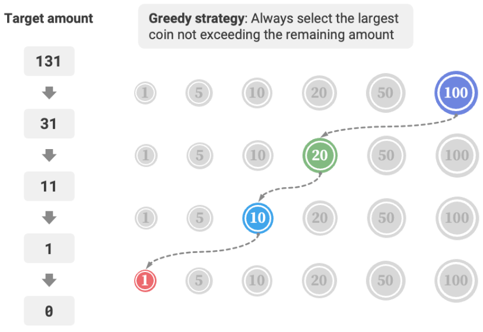

# Greedy [Fastest] [Step-by-Step] [Loop]

## Description

Greedy algorithm is a common algorithm for solving optimization problems, which fundamentally involves making the seemingly best choice at each decision-making stage of the problem, i.e., greedily making locally optimal decisions in hopes of finding a globally optimal solution.
Greedy algorithms are concise and efficient, and are widely used in many practical problems.

!!! info

    Greedy algorithms and dynamic programming are both commonly used to solve optimization problems. They share some similarities, such as relying on the property of optimal substructure, but they operate differently.

    - Dynamic programming considers all previous decisions at the current decision stage and uses solutions to past subproblems to construct solutions for the current subproblem.
    - Greedy algorithms do not consider past decisions; instead, they proceed with greedy choices, continually narrowing the scope of the problem until it is solved.

## Advantages & Limitations

**Greedy algorithms are not only straightforward and simple to implement, but they are also usually very efficient**.
In the Coin Change problem, if the smallest coin denomination is $\min(coins)$, the greedy choice loops at most $amt / \min(coins)$ times, giving a time complexity of $O(amt / \min(coins))$.
This is an order of magnitude smaller than the time complexity of the dynamic programming solution, which is $O(n \times amt)$.

However, **for some combinations of coin denominations, greedy algorithms cannot find the optimal solution**.
The figure below provides two examples.

- **Positive example $coins = [1, 5, 10, 20, 50, 100]$**: In this coin combination, given any $amt$, the greedy algorithm can find the optimal solution.
- **Negative example $coins = [1, 20, 50]$**: Suppose $amt = 60$, the greedy algorithm can only find the combination $50 + 1 \times 10$, totaling 11 coins, but dynamic programming can find the optimal solution of $20 + 20 + 20$, needing only 3 coins.
- **Negative example $coins = [1, 49, 50]$**: Suppose $amt = 98$, the greedy algorithm can only find the combination $50 + 1 \times 48$, totaling 49 coins, but dynamic programming can find the optimal solution of $49 + 49$, needing only 2 coins.


This means that for the coin change problem, greedy algorithms cannot guarantee finding the globally optimal solution, and they might find a very poor solution.
They are better suited for dynamic programming.

Generally, the suitability of greedy algorithms falls into two categories.

1. **Guaranteed to find the optimal solution**: In these cases, greedy algorithms are often the best choice, as they tend to be more efficient than backtracking or dynamic programming.
2. **Can find a near-optimal solution**: Greedy algorithms are also applicable here. For many complex problems, finding the global optimal solution is very challenging, and being able to find a high-efficiency suboptimal solution is also very commendable.

## Use Cases

=== "When to Use"

    Compared to dynamic programming, greedy algorithms have stricter usage conditions, focusing mainly on two properties of the problem.

    - **Greedy choice property**: Only when the locally optimal choice can always lead to a globally optimal solution can greedy algorithms guarantee to obtain the optimal solution.
    - **Optimal substructure**: The optimal solution to the original problem contains the optimal solutions to its subproblems.

=== "Typical Problems"

    Greedy algorithms are often applied to optimization problems that satisfy the properties of greedy choice and optimal substructure.
    Below are some typical greedy algorithm problems.

    - **Coin change problem**: In some coin combinations, the greedy algorithm always provides the optimal solution.
    - **Interval scheduling problem**: Suppose you have several tasks, each of which takes place over a period of time. Your goal is to complete as many tasks as possible. If you always choose the task that ends the earliest, then the greedy algorithm can achieve the optimal solution.
    - **Fractional knapsack problem**: Given a set of items and a carrying capacity, your goal is to select a set of items such that the total weight does not exceed the carrying capacity and the total value is maximized. If you always choose the item with the highest value-to-weight ratio (value / weight), the greedy algorithm can achieve the optimal solution in some cases.
    - **Stock trading problem**: Given a set of historical stock prices, you can make multiple trades, but you cannot buy again until after you have sold if you already own stocks. The goal is to achieve the maximum profit.
    - **Huffman coding**: Huffman coding is a greedy algorithm used for lossless data compression. By constructing a Huffman tree, it always merges the two nodes with the lowest frequency, resulting in a Huffman tree with the minimum weighted path length (coding length).
    - **Dijkstra's algorithm**: It is a greedy algorithm for solving the shortest path problem from a given source vertex to all other vertices.

## Example

=== "Coin Change"

    !!! question

        Given $n$ types of coins, where the denomination of the $i$th type of coin is $coins[i - 1]$, and the target amount is $amt$, with each type of coin available indefinitely, what is the minimum number of coins needed to make up the target amount? If it is not possible to make up the target amount, return $-1$.

    ```python
    def coin_change_greedy(coins: list[int], amt: int) -> int:
        # Assume coins list is ordered
        i = len(coins) - 1
        count = 0

        # Loop for greedy selection until no remaining amount
        while amt > 0:
            # Find the smallest coin close to and less than the remaining amount
            while i > 0 and coins[i] > amt:
                i -= 1

            # Choose coins[i]
            amt -= coins[i]
            count += 1

        return count if amt == 0 else -1  # If no feasible solution is found, return -1
    ```

    

=== "Fractional Knapsack"

    !!! question

        Given $n$ items, the weight of the $i$-th item is $wgt[i-1]$ and its value is $val[i-1]$, and a knapsack with a capacity of $cap$. Each item can be chosen only once, **but a part of the item can be selected, with its value calculated based on the proportion of the weight chosen**, what is the maximum value of the items in the knapsack under the limited capacity? An example is shown in the figure below.

    ```python
    class Item:
        def __init__(self, w: int, v: int):
            self.w = w  # Item weight
            self.v = v  # Item value

    def fractional_knapsack(wgt: list[int], val: list[int], cap: int) -> int:
        items = [Item(w, v) for w, v in zip(wgt, val)]  # Create an item list, containing two properties: weight, value
        items.sort(key=lambda item: item.v / item.w, reverse=True)  # Sort by unit value item.v / item.w from high to low

        # Loop for greedy selection
        res = 0
        for item in items:
            if item.w <= cap:
                # If the remaining capacity is sufficient, put the entire item into the knapsack
                res += item.v
                cap -= item.w
            else:
                # If the remaining capacity is insufficient, put part of the item into the knapsack
                res += (item.v / item.w) * cap
                break  # No remaining capacity left, thus break the loop

        return res
    ```
