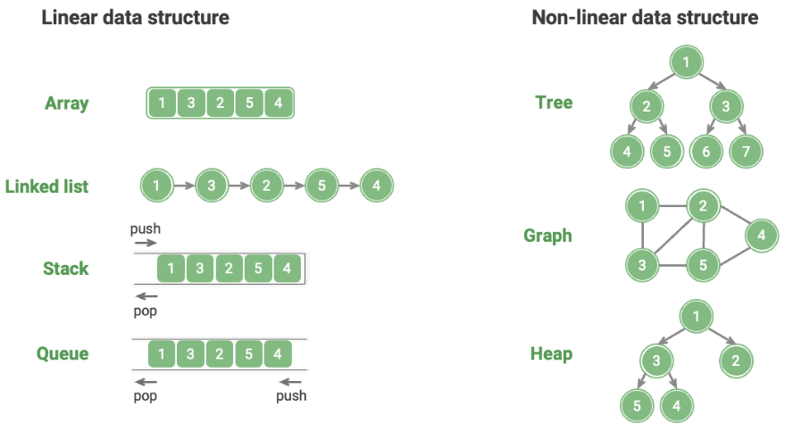

# Overview

## Description

All data structures are implemented based on arrays, linked lists, or a combination of both.
For example, stacks and queues can be implemented using either arrays or linked lists; while implementations of hash tables may involve both arrays and linked lists.

- **Array-based implementations**: Stacks, Queues, Hash Tables, Trees, Heaps, Graphs, Matrices, Tensors
- **Linked-list-based implementations**: Stacks, Queues, Hash Tables, Trees, Heaps, Graphs, etc.

Data structures implemented based on arrays are also called "**Static Data Structures**" meaning their **length cannot be changed** after initialization.
Conversely, those based on linked lists are called "**Dynamic Data Structures**" which can still **adjust their size during program execution**.

## Logical Structure

Logical structures define relationships between data elements.

**Linear structures**, like arrays and linked lists, organize data in a sequence, while **non-linear structures** like trees and graphs use hierarchical or network relationships.

- **Linear structures**: Arrays, Linked Lists, Stacks, Queues, Hash Tables
- **Non-linear structures**: Trees, Heaps, Graphs, Hash Tables (which fit both categories)

Non-linear structures are split into:

- **Tree structures** (Trees, Heaps, Hash Tables): One-to-many relationships.
- **Network structures** (Graphs): Many-to-many relationships.
