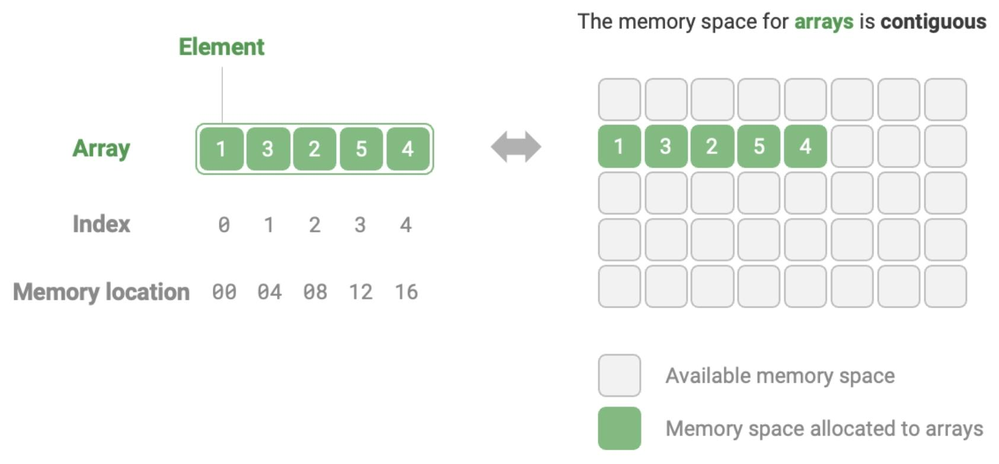

# Array

## Description

An array is a linear data structure that operates as a lineup of **similar items**, stored together in a computer's memory in **contiguous spaces**. It's like a sequence that maintains organized storage.

