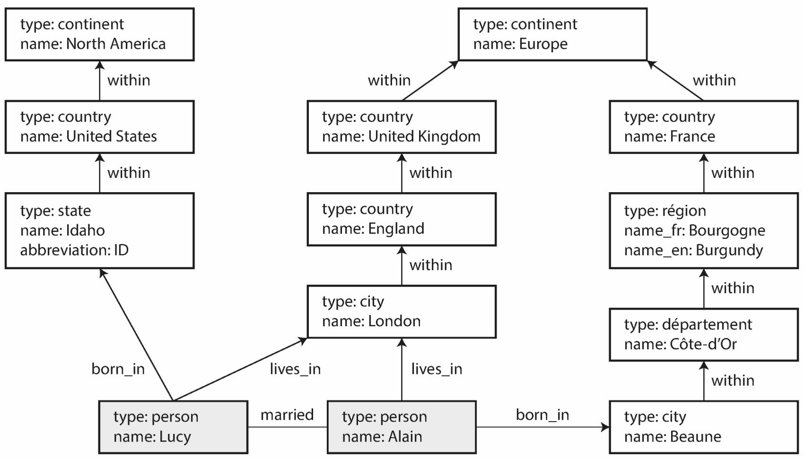
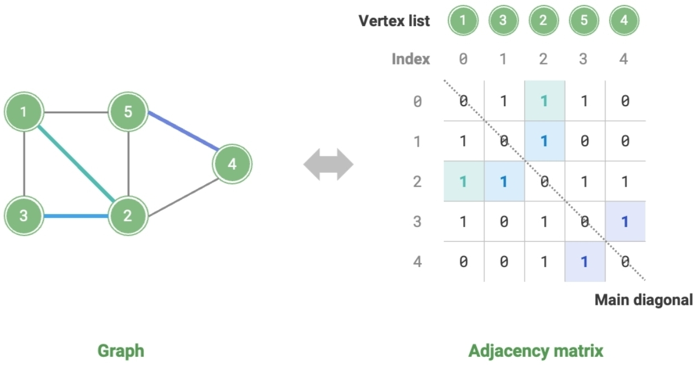
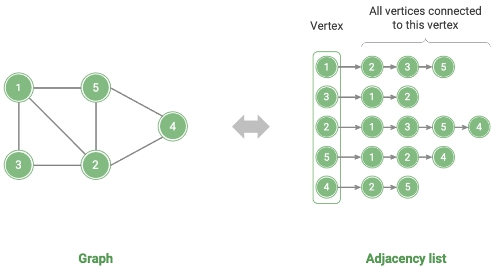
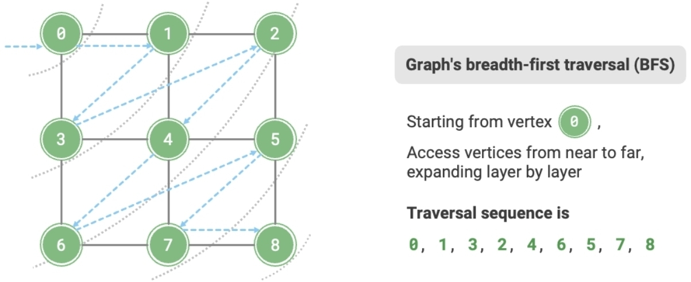
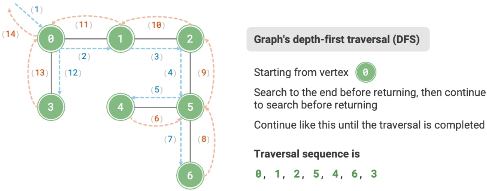

# Graph

## Description

- A collection of nodes connected by edges, representing relationships between nodes.
- many-to-many relationships in DB.
- Vertices: known as nodes or entities
- Edges: known as relationships or arcs
- Graphs are good for evolvability: as you add features to your application, a graph can easily be extended to accommodate changes in your application's data structures.

Graphs are not limited to only homogeneous data: an equally powerful use of graphs is to provide a consistent way of storing completely different types of objects in a single datastore.

## Representation (Implementation)

### Adjacency Matrix

Let the number of vertices in the graph be $n$, the adjacency matrix uses an $n \times n$ matrix to represent the graph, where each row (column) represents a vertex, and the matrix elements represent edges, with 1 or 0 indicating whether there is an edge between two vertices.

When representing graphs with adjacency matrices, it is possible to directly access matrix elements to obtain edges, resulting in efficient operations of addition, deletion, lookup, and modification, all with a time complexity of $O(1)$. However, the space complexity of the matrix is $O(n^2)$, which consumes more memory.

### Adjacency List

The adjacency list uses $n$ linked lists to represent the graph, with each linked list node representing a vertex.
The $i$-th linked list corresponds to vertex $i$ and contains all adjacent vertices (vertices connected to that vertex).

## Operations

|                     | Adjacency matrix | Adjacency list (Linked list) | Adjacency list (Hash table) |
| ------------------- | ---------------- | ---------------------------- | --------------------------- |
| Determine adjacency | $O(1)$           | $O(m)$                       | $O(1)$                      |
| Add an edge         | $O(1)$           | $O(1)$                       | $O(1)$                      |
| Remove an edge      | $O(1)$           | $O(m)$                       | $O(1)$                      |
| Add a vertex        | $O(n)$           | $O(1)$                       | $O(1)$                      |
| Remove a vertex     | $O(n^2)$         | $O(n + m)$                   | $O(n)$                      |
| Memory space usage  | $O(n^2)$         | $O(n + m)$                   | $O(n + m)$                  |

!!! info

    Observing the table, it seems that the adjacency list (hash table) has the best time efficiency and space efficiency.
    However, in practice, operating on edges in the adjacency matrix is more efficient, requiring only a single array access or assignment operation.
    Overall, the adjacency matrix exemplifies the principle of "space for time", while the adjacency list exemplifies "time for space".

## Varieties

### Property Graphs

In the property graph model, each vertex consists of:

- A unique identifier
- A set of outgoing edges
- A set of incoming edges
- A collection of properties (key-value pairs)

Each edge consists of:

- A unique identifier
- The vertex at which the edge starts (the tail vertex)
- The vertex at which the edge ends (the head vertex)
- A label to describe the kind of relationship between the two vertices
- A collection of properties (key-value pairs)

### Triple-Stores Graphs

The triple-store model is mostly equivalent to the property graph model, using different words to describe the same ideas.

In a triple-store, all information is stored in the form of very simple three-part statements: (subject, predicate, object).
For example, in the triple (Jim, likes, bananas), Jim is the subject, likes is the predicate (verb), and bananas is the object.

The subject of a triple is equivalent to a vertex in a graph. The object is one of two things:

1. A value in a primitive data type, such as a string or a number. In that case, the predicate and object of the triple are equivalent to the key and value of a property on the subject vertex. For example, (lucy, age, 33) is like a vertex lucy with properties {"age":33}.
2. Another vertex in the graph. In that case, the predicate is an edge in the graph, the subject is the tail vertex, and the object is the head vertex. For example, in (lucy, marriedTo, alain) the subject and object lucy and alain are both vertices, and the predicate marriedTo is the label of the edge that connects them.

## Use Cases

| Application     | Vertices         | Edges                                         | Graph Computing Problem             |
| --------------- | ---------------- | --------------------------------------------- | ----------------------------------- |
| Social Networks | Users            | Follow / Followed                             | Potential Following Recommendations |
| Subway Lines    | Stations         | Connectivity Between Stations                 | Shortest Route Recommendations      |
| Solar System    | Celestial Bodies | Gravitational Forces Between Celestial Bodies | Planetary Orbit Calculations        |

## Traversal

### Breadth-first search (BFS)

Breadth-first search is a near-to-far traversal method, starting from a certain node, always prioritizing the visit to the nearest vertices and expanding outwards layer by layer.

### Depth-first search (DFS)

Depth-first search is a traversal method that prioritizes going as far as possible and then backtracks when no further path is available.

