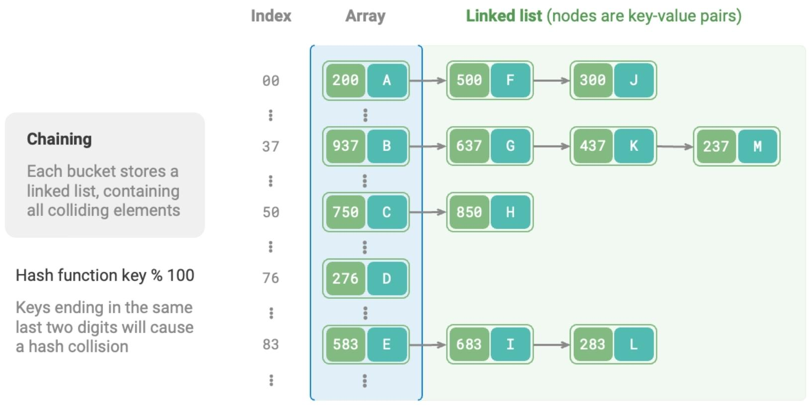

# Hash Table (Hash Map)

## Description

Data structure that maps keys to values, allowing for efficient retrieval of values based on their keys.

## Hash Collision

Essentially, the role of the hash function is to map the entire input space of all keys to the output space of all array indices.
However, the input space is often much larger than the output space.
Therefore, theoretically, there will always be cases where "multiple inputs correspond to the same output".

To solve the problem we have two options:

- Separate chaining (Java, Go, and C#)
- Open addressing (Python)

**Separate Chaining**: In the original hash table, each bucket can store only one key-value pair.
Separate chaining converts a single element into a linked list, treating key-value pairs as list nodes, storing all colliding key-value pairs in the same linked list.

**Open Addressing**: Open addressing does not introduce additional data structures but instead handles hash collisions through "multiple probing".
Calculate the bucket index using the hash function, If the bucket already contains an element, linearly traverse forward from the conflict position (usually with a step size of 1) until an empty bucket is found, then insert the element.

