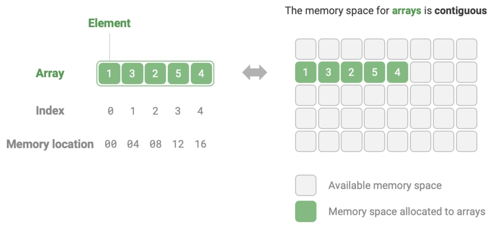

# Array

## Description

An array is a linear data structure that operates as a lineup of **similar items**, stored together in a computer's memory in **contiguous spaces**.
It's like a sequence that maintains organized storage.

## Operations

| Operation          | Complexity |
| ------------------ | ---------- |
| Access element     | $O(1)$     |
| Search element     | $O(n)$     |
| Insert at end      | $O(1)$     |
| Insert at middle   | $O(n)$     |
| Delete at end      | $O(1)$     |
| Delete at middle   | $O(n)$     |
| Memory space usage | $O(n)$     |
