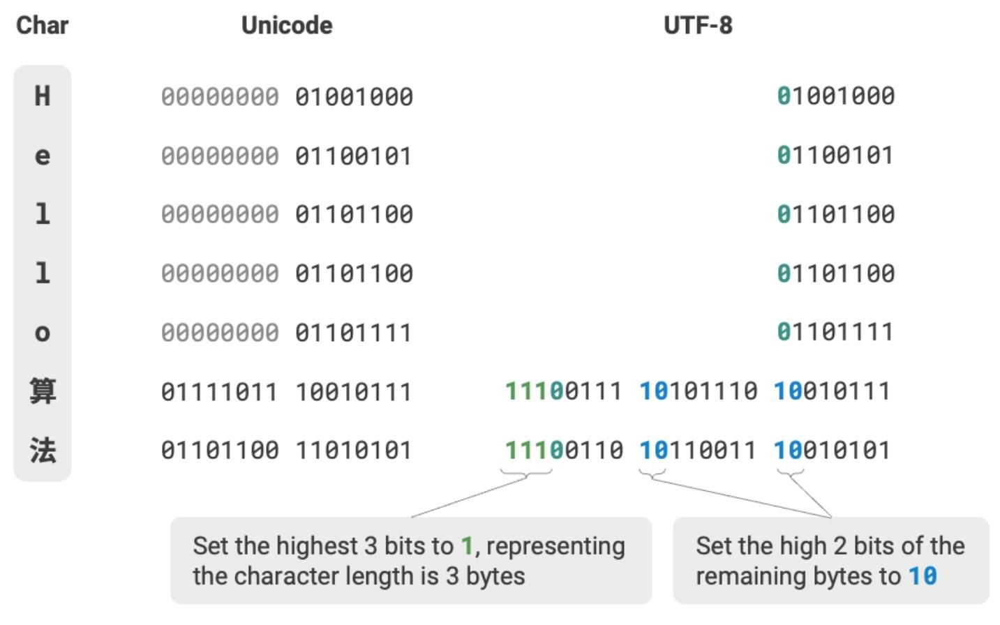

# Characters

## ASCII and EASCII

ASCII was initially designed to represent English characters using 7 bits but was expanded to 8 bits in the form of EASCII, allowing it to support 256 characters.

However, this is still insufficient for languages with larger character sets like Chinese, which led to the creation of other encodings, for this reason Unicode was invented.

## Unicode

Unicode was developed to address the limitations of various character encodings by creating a universal character set that includes over 149,000 characters across many languages.
This system aims to standardize encoding to prevent incompatibility issues across different systems.

Since it does not specify how these character code points should be stored in a computer system, the UTF encodings were invented.

## UTF

UTF-8 is the most widely used encoding format for Unicode, utilizing a variable length of 1 to 4 bytes depending on the complexity of the character.
It is efficient for encoding English text (1 byte per character) but can handle complex scripts as well.

UTF-8 encoding is backward compatible with ASCII. This implies that UTF-8 can be used to parse ancient ASCII text.

- **UTF-16 encoding**: Uses 2 or 4 bytes to represent a character. All ASCII characters and commonly used non-English characters are represented with 2 bytes; a few characters require 4 bytes. For 2-byte characters, the UTF-16 encoding equals the Unicode code point.
- **UTF-32 encoding**: Every character uses 4 bytes. This means UTF-32 occupies more space than UTF-8 and UTF-16, especially for texts with a high proportion of ASCII characters.

From the perspective of storage space, using UTF-8 to represent English characters is very efficient because it only requires 1 byte; using UTF-16 to encode some non-English characters (such as Chinese) can be more efficient because it only requires 2 bytes, while UTF-8 might need 3 bytes.
