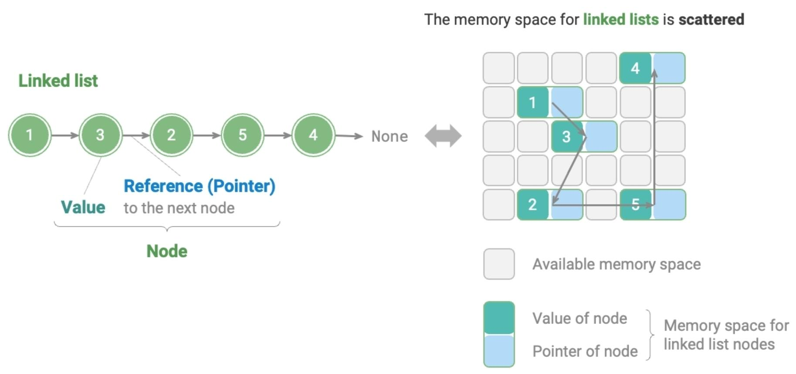

# Linked List

## Description

A linked list is a linear data structure in which each element is a node object, and the nodes are interconnected through "references".
These references hold the memory addresses of subsequent nodes, enabling navigation from one node to the next.

The design of linked lists allows for their nodes to be distributed across memory locations **without requiring contiguous memory addresses**.

- The first node in a linked list is the "head node", and the final one is the "tail node".
- The tail node points to "null".
- In languages that support pointers, this "reference" is typically implemented as a "pointer".

## Varieties

=== "Singly"

    Singly linked list is the standard linked list described earlier.

=== "Circular"

    Circular linked list is formed when the tail node of a singly linked list points back to the head node, creating a loop.
    In a circular linked list, any node can function as the head node.

=== "Doubly"

    In contrast to a singly linked list, a doubly linked list maintains references in two directions.
    Each node contains references (pointer) to both its successor (the next node) and predecessor (the previous node).
