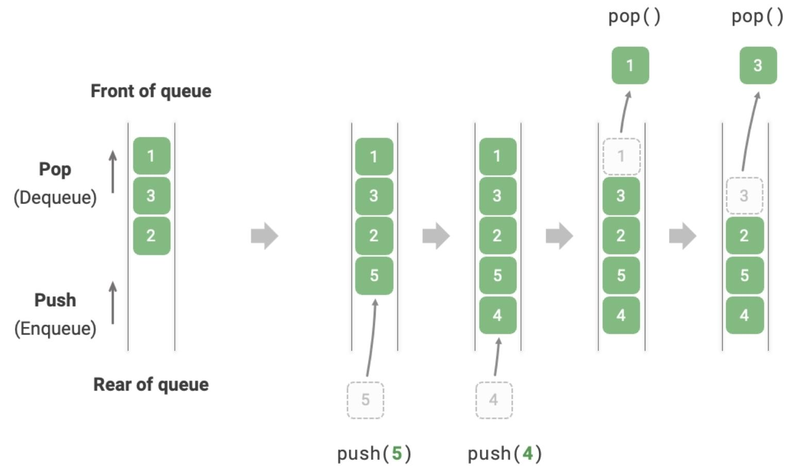
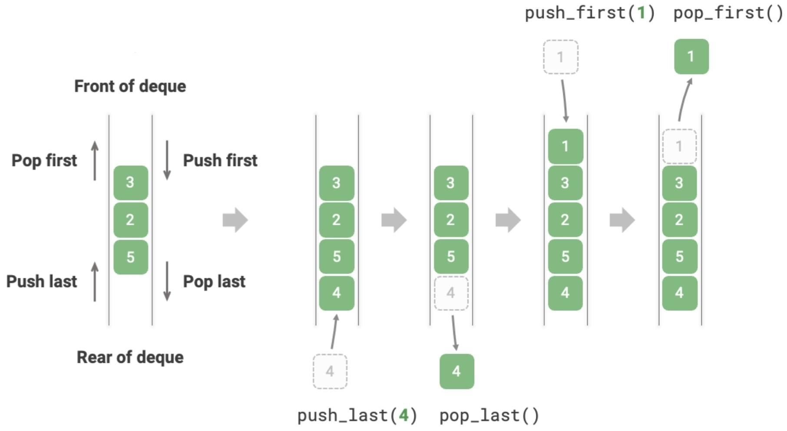

# Queue

## Description

A First In, First Out (FIFO) data structure, where elements are added at the rear and removed from the front.

## Varieties

=== "Double-Ended"

    Double-Ended (Deque) allows elements to be added or removed from both ends.

    

=== "Priority"

    Priority Queue is a variation of a queue where each element is assigned a priority, and the element with the highest priority is served first.
