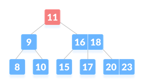

# B-Tree (Balanced Tree)

## Description

A B-Tree is a self-balancing search tree that maintains sorted data and allows searches, insertions, deletions, and sequential access in logarithmic time.

- Each node can have multiple keys and child pointers.
- A balanced structure ensures efficient search operations.
- Commonly used in file systems and databases for indexing.

## Operations

| Operation                  | Complexity  |
| -------------------------- | ----------- |
| Search                     | $O(\log n)$ |
| Insert                     | $O(\log n)$ |
| Delete                     | $O(\log n)$ |
| Find minimum/maximum       | $O(\log n)$ |
| Find predecessor/successor | $O(\log n)$ |
| Memory space usage         | $O(n)$      |
| Split node                 | $O(t)$      |
| Merge nodes                | $O(t)$      |
