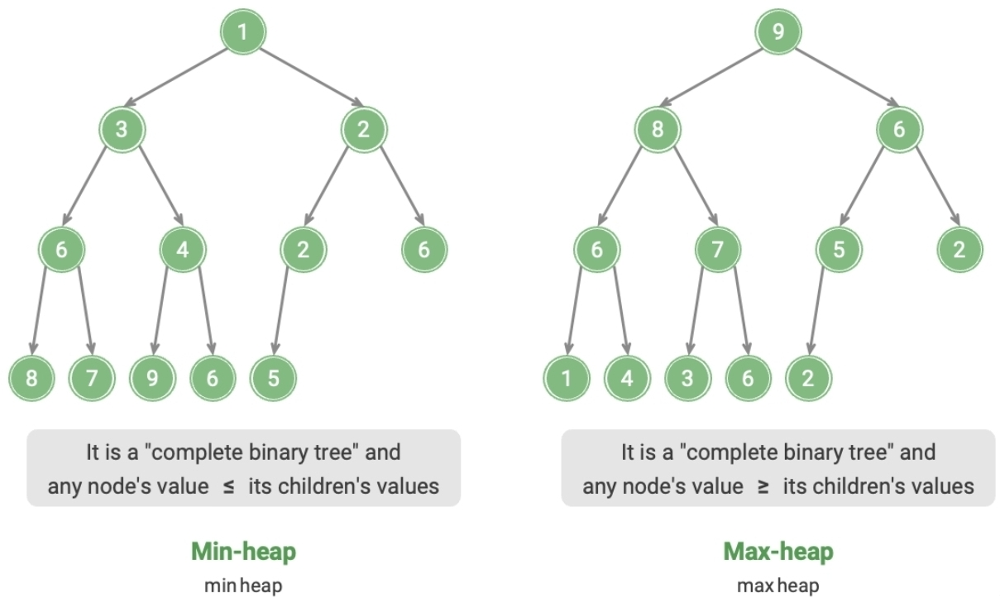

# Heap [Binary Tree]

## Description

A heap is a complete binary tree that satisfies specific conditions and can be mainly categorized into two types:

- min heap : The value of any node ≤ the values of its child nodes.
- max heap : The value of any node ≥ the values of its child nodes.

As a special case of a complete binary tree, a heap has the following characteristics:

- The bottom layer nodes are filled from left to right, and nodes in other layers are fully filled.
- The root node of the binary tree is called the "top" of the heap, and the bottom-rightmost node is called the "bottom" of the heap.
- For max heaps (min heaps), the value of the top element (root) is the largest (smallest) among all elements.

!!! info

    In practice, **heaps are often used to implement priority queues. A max heap corresponds to a priority queue where elements are dequeued in descending order.**

    From a usage perspective, we can consider "priority queue" and "heap" as equivalent data structures.

## Operations

| Operation                                                    | Complexity  |
| ------------------------------------------------------------ | ----------- |
| Add an element                                               | $O(\log n)$ |
| Remove the top element                                       | $O(\log n)$ |
| Access the top element (for max/min heap, the max/min value) | $O(1)$      |
| Get the number of elements                                   | $O(1)$      |
| Check if the heap is empty                                   | $O(1)$      |

## Use Cases

- **Priority Queue**: Heaps are often the preferred data structure for implementing priority queues, with both enqueue and dequeue operations having a time complexity of $O(\log n)$, and building a queue having a time complexity of $O(n)$, all of which are very efficient.
- **Heap Sort**: Given a set of data, we can create a heap from them and then continually perform element removal operations to obtain ordered data. However, there is a more elegant way to implement heap sort, as explained in the "Heap Sort" chapter.
- **Finding the Largest $k$ Elements**: This is a classic algorithm problem and also a common use case, such as selecting the top 10 hot news for Weibo hot search, picking the top 10 selling products, etc.
