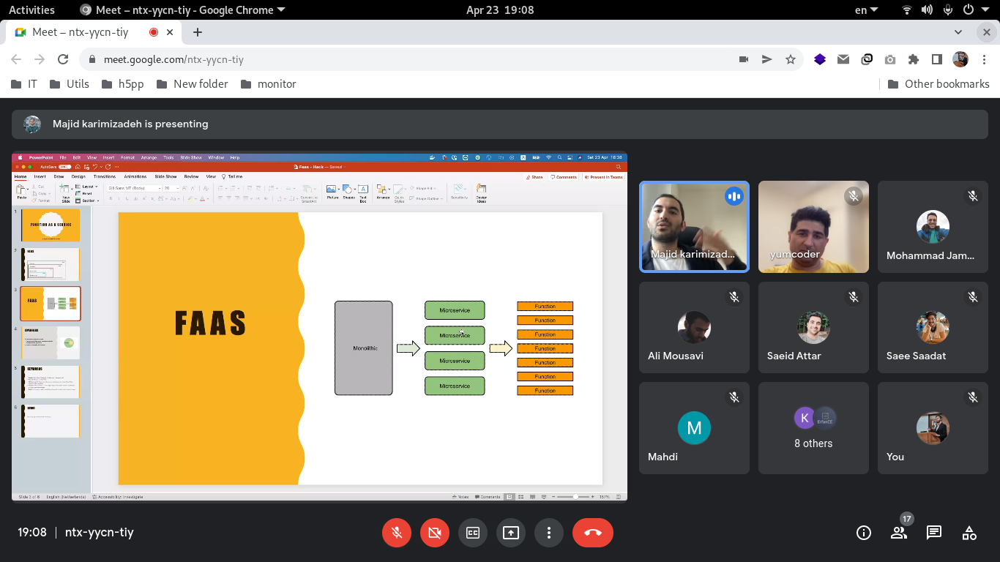

# FASS

## Description

- **IAAS**: infrastructure as a service
- **PAAS**: Platform as a service
- **SAAS**: Software as a service
- **FAAS**: Function as a service

## References

- **OpenFAAS**: [openfaas/faas](https://github.com/openfaas/faas)
- **OpenFAAS quickstart**: [majidkarimizadeh/openfass](https://github.com/majidkarimizadeh/openfass)
