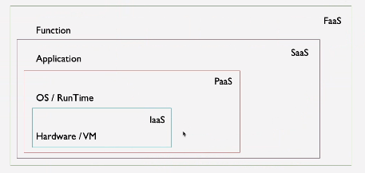

# FASS

## Description

- **IAAS**: infrastructure as a service
- **PAAS**: Platform as a service
- **SAAS**: Software as a service
- **FAAS**: Function as a service

## References

- **OpenFAAS**: [openfaas/faas](https://github.com/openfaas/faas)
- **OpenFAAS quickstart**: [majidkarimizadeh/openfass](https://github.com/majidkarimizadeh/openfass)
- **Arkade**: Open Source Marketplace For Kubernetes – Developer tool.
- **Faas-cli**: Official CLI for OpenFaaS.
- **API Gateway**: Provides an external route into your functions and collects Cloud Native metrics through Prometheus.
- **Template**: The OpenFaaS CLI has a template engine built-in which can create new functions in a given programming language.
- **Registry**: A container registry is a collection of repositories made to store container images.
